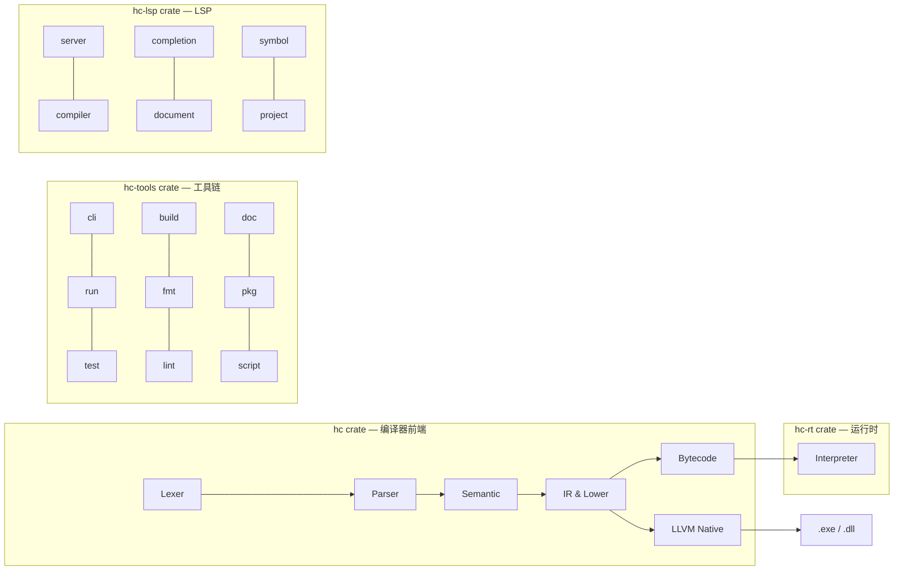

<p align="center">
  
</p>

# H 语言工具链

H 是一门**以数据为中心**、同时支持**系统编程与脚本编程**的编程语言（源码后缀 `.hc`）。核心哲学：语言的职责是「**定义数据、修改数据、传输数据、保存数据**」。同一份源码既可编译为原生二进制，也可作为脚本解释执行，**两种模式语义一致**。

- **定位**：严肃长期项目，对标 Zig / Go，参考优先级 Zig → Rust → TypeScript
- **实现语言**：Rust（初始实现，零外部依赖），见 `docs/adr/0002-initial-compiler-in-rust.md`
- **核心承诺**：双模式一致 —— 脚本模式与编译模式共享同一语义源，禁止后端私语义

## 当前状态

| 项 | 状态 |
|---|---|
| **第一部分「最小功能集」（M0–M7）** | ✅ **已完成**（`tag1/` 垂直切片，2026-08-17），**不自举** |
| 语言系统（M0–M4） | ✅ 已完成：前端 / 语义 / 双后端 / 运行时与内建 |
| 最小外围（M5–M7） | ✅ 已完成：最小标准库 / 测试基建 / 工具链最小 |
| 测试 | `cargo test --workspace` **1000+ 项全绿**（2026-08-25，含新增 chan/mutex/scheduler 测试） |
| 示例回归 | 解释模式 **147 passed / 0 failed / 1 skipped**（全部转绿） |
| 原生交叉验证 | 编译模式 **57 项 mismatch**（21 Unsupported + 31 运行时 + 3 其他；未实现原生内建以 `error.*` 响亮中止） |
| 第三块（E1–E7） | 🟡 推进中 —— **E1 元编程 / E2 并发与异步 / E3 标准库扩展 / E4 系统编程 / E5 工具链扩展已全部落地**；**E6 语言扩展部分落地**；**E7 自举 K1 lexer ✅，K2–K6 待实现** |
| CI | 每次 push/PR 运行完整示例套件回归门（`tag1/scripts/check-examples.sh`） |
| 原生编译依赖 | 外部 `zig cc`（`hc build` / `hc test --mode=compile` 需要，缺失时回退字节码产物） |

> **注意**：`tag1/` 为**垂直切片**实现 —— 全部 7 个里程碑的核心功能已打通，非全量交付；余量（如 LLVM 原生仅内建子集、字节码 VM 复用 IR 语义）按模块登记于 `docs/SPEC/phase1/07-bootstrap-plan.md` 第八节与 `tag1/README.md`「已知取舍」。

## 仓库结构

```
H2/
├── tag1/        # 第一部分最小功能集实现（Rust，四 crate 工作区，零外部依赖）
│   ├── hc/           # 编译器前端：lexer → parser → semantic → IR → codegen
│   ├── hc-rt/        # 运行时：值模型 + tree-walking 解释器
│   ├── hc-tools/     # 工具链 CLI：hc run / test / build / fmt / lint / doc / pkg
│   ├── hc-lsp/       # LSP 语言服务器（诊断 / 补全 / 跳转 / 悬停）
│   └── examples/     # tag1 演示用例
├── docs/        # 设计文档：SPEC（phase1–4）、ADR 决策记录、review 裁定
├── examples/    # 示例套件（语法 / 惯用法 / 模式 / 并发 / 工具等 91 例，编号 01–91）
├── extensions/  # Zed 编辑器扩展（Tree-sitter 语法高亮 + LSP 语言服务器）
├── stage1/      # 自举第一阶段：H 版 lexer/parser/语义分析（K1–K3，K3 推进中）
├── bin/         # 预编译二进制（hc-lsp.exe, hc.exe）
├── RESEARCH/    # 参考语言事实档案与功能比对
├── CONTEXT.md   # 术语表与项目背景
└── H.logo.png   # H 语言 logo
```

## 编译器管道

编译器和运行时按管道阶段组织，每个阶段对应一个目录，内部按功能点拆分文件：



### 编译器管道阶段（`hc/src/`）

| 阶段 | 目录 | 文件 | 说明 |
|------|------|------|------|
| 1. 词法分析 | `lexer/` | `mod.rs`, `token.rs` | Token 类型、词法分析器 |
| 2. 语法分析 | `parser/` | `mod.rs`, `ast.rs`, `decl.rs`, `expr.rs`, `stmt.rs`, `type.rs`, `type_decl.rs`, `util.rs` | AST 类型、递归下降解析器 |
| 3. 语义分析 | `semantic/` | `mod.rs`, `check.rs`, `collect.rs`, `error_infer.rs`, `infer.rs`, `resolve.rs`, `validate.rs`, `trait_registry.rs` | 名称解析、类型检查、所有权、错误集推断 |
| 4. IR 降级 | `ir/` | `mod.rs`, `builtin.rs`, `comptime.rs`, `json.rs`, `lower_impl.rs`, `method.rs`, `ops.rs`, `runtime.rs`, `types.rs` | 共享 IR（唯一语义源） |
| 5a. 字节码 | `codegen/bytecode/` | `mod.rs`, `encode.rs`, `decode.rs`, `opcode.rs`, `tests.rs` | HBC2 序列化 + 装载执行 |
| 5b. LLVM 原生 | `codegen/llvm/` | `mod.rs`, `body.rs`, `emit.rs`, `helpers.rs`, `preamble.rs`, `tests.rs`, `text.rs` | LLVM IR 文本发射 + zig cc 编译 |
| 6. 诊断 | `diag/` | `mod.rs` | 多错误收集、精确位置报告 |
| 7. 运行时共享层 | `runtime/` | `mod.rs`, `regex.rs`, `rle.rs`, `compress.rs`, `rng.rs`, `errorcodes.rs`, `ds_*.rs` | 纯函数共享层（ADR-0004），供解释器与 IR 后端共用 |

### 工具链命令（`hc-tools/src/`）

| 命令 | 目录 | 说明 |
|------|------|------|
| `hc run` | `run/` | 脚本模式 / 字节码 VM / IR 参考解释器 |
| `hc test` | `test/` | 测试收集与运行（含 `--mode=compile` 交叉验证） |
| `hc build` | `build/` | 原生编译（LLVM + zig cc） |
| `hc fmt` | `fmt/` | 代码格式化（token 级重排 + AST 保真 + `--check`） |
| `hc lint` | `lint/` | 静态检查（9 规则 + `--json`） |
| `hc doc` | `doc/` | 文档生成（Markdown + 索引页） |
| `hc pkg` | `pkg/` | 包管理（add / publish） |
| `hc init` | `project/` | 项目骨架初始化 |
| `hc script` | `script/` | 脚本解析与缓存 |
| `hc comptime` | `comptime/` | Comptime 值函数生成 |
| CLI 入口 | `cli/` | 命令分发、版本管理 |

### LSP 语言服务器（`hc-lsp/src/`）

| 模块 | 目录 | 说明 |
|------|------|------|
| 服务器 | `lsp/` | LSP 协议处理 |
| 编译器 | `compiler/` | 源码编译与诊断 |
| 补全 | `completion/` | 自动补全 |
| 文档 | `document/` | 文档管理 |
| 符号 | `symbol/` | 符号表与跳转定义 |
| 项目 | `project/` | 项目上下文 |

详见 [`tag1/README.md`](tag1/README.md)。

`extensions/zed/` 为 Zed 编辑器扩展，提供 Tree-sitter 语法高亮 + LSP 语言服务器集成（`hc-lsp`），详见 [`extensions/zed/README.md`](extensions/zed/README.md)。

## H 语言路线图

实现计划分**三块**（`docs/SPEC/phase1/07-bootstrap-plan.md`），前两块构成**第一部分「最小功能集」**（`tag1` 已实现），第三块为**扩展与自举**（E1–E4 已落地，见下）。

### ✅ 已完成 —— 第一部分「最小功能集」（M0–M7）

**第一块 · 语言系统**

| 里程碑 | 内容 | 状态 |
|---|---|---|
| M0 地基 | cargo 四 crate 工作区（零外部依赖） | ✅ 已完成 |
| M1 前端 | 词法 / 语法（AST）/ 多错误诊断 / 跨文件模块（namespace / import / 目录 = 包） | ✅ 已完成 |
| M2 语义 | 名称解析（重载池 + 接口三用途）/ 类型检查（表达式级 + 期望类型传播）/ 推断（泛型 / 指针形态 / 重载歧义）/ 所有权（分配来源 + move 合法性 + 引用逃逸）/ 错误集（错误码表 + `!T` 推断收集）/ 函数（重载 / 闭包捕获精确化） | ✅ 已完成 |
| M3 双后端 | 共享 IR（唯一语义源）/ 字节码 VM（HBC2）/ LLVM 原生（emit-.ll + zig cc）/ 一致性套件（CI 硬门槛） | ✅ 已完成 |
| M4 运行时与内建 | 内存模型（作用域 LIFO + Arena）/ 错误码运行时表示 / `@` 内建基础集 / 序列化内建 / 标量接口族 / 迭代内建 / Debug 悬垂标记 | ✅ 已完成 |

**第二块 · 最小外围**

| 里程碑 | 内容 | 状态 |
|---|---|---|
| M5 最小标准库 | mem（Allocator/Arena）/ collections（Vec / String / Map / Deque）/ io（print / fs / net TCP / 程序环境）/ 时间与工具 | ✅ 已完成 |
| M6 测试基建 | `[test]` 测试收集 / 断言五件套 / `[PASS] [FAIL] [SKIP]` 汇总 / 失败非零退出 | ✅ 已完成 |
| M7 工具链最小 | `hc run` / `hc test`（含 `--mode=compile` 交叉验证）/ `hc build` / `hc check` / `hc errors` / build.zon 包基础 | ✅ 已完成 |

**双后端**：四个后端共享同一语义源（`IrModule` + `run_ir`，ADR-0004）：

| 后端 | 入口 | 覆盖 |
|---|---|---|
| tree-walking 解释器 | `hc run <file.hc>`（默认） | **全语言** |
| IR 参考解释器 | `hc run --ir <file.hc>` | M3.1–Phase 6/7/8 子集（唯一语义源） |
| 字节码 VM | `hc run <file.hbc>`（HBC2） | 子集，复用 IR 语义 |
| LLVM 原生 | `hc build <file.hc>` | 子集（已实现内建子集，57 mismatch 属此） |

### 🟡 推进中 —— 第三块 · 扩展与自举（E1–E7）

> **2026-08-25**：E2 并发模型重构完成——从「OS 线程 + 四模式容器」迁移到「M:N 协程 + 单一通道 `chan<T>`」。
> 新增：`chan<T>` 类型（send/recv/try_send/try_recv/close）、M:N 协程调度器（G+P+M 模型）、`Mutex` 类型（lock/try_lock）。
> 四模式容器（Pipe/Tee/Funnel/Hub）已标记弃用，推荐使用 `chan<T>` 替代。
> E3/E6 新增：惰性迭代器（A7）、LZ77 压缩（A3）、时区完整（A4）、标准库数据结构（A6：bitmap/ringbuf/pagemem/intrlist/treemap）。
> E7 自举：K1 lexer 完成（6621 token 零 diff），K2 parser 部分实现

| 里程碑 | 内容 | 状态 |
|---|---|---|
| E1 元编程 | 脚本生成（`script` 块）、comptime 完整（类型即值）、泛型完整 | ✅ 已落地（script 块装载期展开 + 序列化定制 + comptime 类型函数/值函数/anytype + 泛型实例化） |
| E2 并发与异步 | 协程 / 通道 / Mutex / 异步 / @atomic / Send·Sync | ✅ 已落地：M:N 协程调度器（G+P+M）+ `chan<T>`（send/recv/try_send/try_recv/close）+ `Mutex`（lock/try_lock）+ async fn/await + Io.threaded/evented + @atomicLoad/Store/Rmw + Send·Sync 编译期诊断。四模式容器（Pipe/Tee/Funnel/Hub）已弃用，推荐使用 `chan<T>` |
| E3 标准库扩展 | 四大支柱完整（含 UDP / HTTP / IPC / FFI / 序列化库 / 标准库数据结构） | ✅ 已落地：net UDP/HTTP、ipc 管道/共享内存、storage/archive、text/time/rng、serialize 库（fmt_int/fmt_float/parse 辅助组）、Table 类型、`hc cc` C 互操作编译、A6 标准库数据结构（bitmap/ringbuf/pagemem/intrlist/treemap）、A3 LZ77 压缩、A4 时区完整、A7 惰性迭代器 |
| E4 系统编程 | 系统编程特性（K1–K11） | ✅ 已落地：K1 无标签 union / K2 volatile / K4 @ptrFromInt·@intFromPtr / K5 export fn + `extern fn` 外部函数声明，K3 asm / K6 freestanding / K7–K11 1.x |
| E5 工具链扩展 | LSP / 格式化 / lint / 文档生成 / 项目脚手架 / 包注册中心 | ✅ 已落地：hc fmt（token 级重排 + AST 保真 + --check）/ hc lint（9 规则 + --json）/ hc doc（Markdown 生成 + 索引页）/ hc lsp（诊断推送 + 自动补全 + 跳转定义 + 悬停提示 + 文档注释）/ hc init 脚手架 / hc cc C 互操作编译 / hc pkg add/publish；B7 质量工具完整（LSP/格式化/lint 集）已完成；Zed 编辑器扩展（Tree-sitter 语法高亮 + LSP 集成）；包注册中心正式版 1.x |
| E6 语言扩展 | 惰性迭代、switch 守卫、开放问题裁决、吃狗粮反馈 | 🟡 部分落地：switch 守卫已实施（模式+if 守卫+穷举检查）；开放问题裁决已定案（ADR-0016/0017）；C5 内建泛型嵌套具体化已实施；C6 格式串 comptime 校验已实施；惰性迭代（A7）已落地；吃狗粮反馈待自举阶段 |
| E7 自举 | 用 H 写编译器（stage1 → stage2），规范一致性交叉验证 | ⏳ 推进中：K1 H版 lexer ✅（6621 token 零 diff），K2 H版 parser 🟢 性能已优化（解析自身 ~1s，较原 60s+ 提升 ~60x，8 项语料对照通过），K3 H版语义分析 ✅ 已完成（11/11 任务，13 项对照测试全部通过，覆盖名称解析/类型检查/所有权分析含引用逃逸/错误集分析/类型错误检测），K4–K6 待实现 |

### 里程碑节点

| 节点 | 内容 | 状态 |
|---|---|---|
| T1（M0–M2 后） | 前端 + 语义完整 | ✅ 已达成 |
| T2（M3 后） | 双后端可运行、双模式一致 | ✅ 已达成 |
| T3（M4 后） | 语言系统完整 | ✅ 已达成 |
| **T4（M5–M7 后）** | **第一部分完成：最小功能集可用（不自举）** | ✅ **已达成（tag1，2026-08-17）** |
| T5（E1–E2 后） | 元编程 + 并发完整 | ✅ 已达成（2026-08-24：元编程 E1 完整；并发 E2 完整含协程+通道+Mutex+async/await+@atomic+Send·Sync） |
| T6（E3–E5 后） | 标准库 + 工具链完整 | 🟡 部分达成（E3 标准库扩展 + E4 系统编程 + E5 工具链扩展已全部落地；A3/A4/A6/A7 已落地；C8 LLVM 原生内建 mismatch 归零 1.x） |
| T7（E7 后） | 自举闭环（用 H 编译 H） | ⏳ 计划 |
| T8（E6 + 冻结） | 1.0 冻结 | ⏳ 计划 |

### 里程碑映射（`docs/SPEC/phase1/02-milestones.md` M0–M10 对照）

三块计划与 1.0 里程碑（M0–M10）的映射关系：第一块语言系统 ≈ 02 的 M1–M6；第二块最小外围 ≈ 02 的 M7–M8 主体；第三块承接脚本生成（M3）、并发（M5）、系统编程缺口、自举（M9）与 1.x 项（脚本生成 / 并发线程·异步 / 系统编程缺口 K1·K2·K4·K5 已于 2026-08-18 落地）。**1.0 的定义**（沿用 Zig 官方前置清单）：语言冻结 → 规范初稿 → 官方包管理器 → 标准库四大支柱 API 稳定 → 完整发布周期无破坏性变更。

## 已知取舍（摘要）

- **原生/IR 后端为已实现内建子集**：`hc build` / `hc test --mode=compile` 覆盖 M3.1 切片 + 指针/聚合/switch/for/闭包/方法/重载/global/const/defer/errdefer/带标签 break·continue + 全核心标准库（IR）；LLVM 原生仅已实现内建子集，未实现内建以 `error.NotBuiltin`/`error.NoMethod`/`error.Unsupported` 响亮中止（**不静默丢弃**）。
- **字节码 VM 复用 `run_ir`**：未做紧凑运行时 dispatch / 寄存器式 VM（性能优化留后续，须一致性套件证明等价）。
- **LLVM 值盒全精度载荷**：`%Value = { i32, i128 }`；`hc build` 依赖外部 `zig cc`，无优化 pass。
- 完整取舍清单见 [`tag1/README.md`](tag1/README.md)「已知取舍」。

## 文档索引

| 文档 | 内容 |
|---|---|
| [`docs/SPEC/README.md`](docs/SPEC/README.md) | 1.0 实现计划总纲（定位 / 时间线 / 文档索引） |
| [`docs/SPEC/phase1/07-bootstrap-plan.md`](docs/SPEC/phase1/07-bootstrap-plan.md) | 三块实现计划 + 实现状态表 |
| [`docs/SPEC/phase1/02-milestones.md`](docs/SPEC/phase1/02-milestones.md) | 阶段里程碑与验收标准（M0–M10） |
| [`docs/SPEC/phase1/06-language-spec.md`](docs/SPEC/phase1/06-language-spec.md) | 语言规范总纲 |
| [`docs/SPEC/00-feature-inventory.md`](docs/SPEC/00-feature-inventory.md) | 功能清单（按领域分类，含完成状态标记） |
| [`tag1/README.md`](tag1/README.md) | 工具链实现说明（构建 / CLI / 测试 / 已知取舍） |
| [`extensions/zed/README.md`](extensions/zed/README.md) | Zed 编辑器扩展说明（安装 / LSP / 语法高亮 / 故障排除） |
| [`CONTEXT.md`](CONTEXT.md) | 术语表与项目背景 |
| [`examples/README.md`](examples/README.md) | 示例套件说明 |
