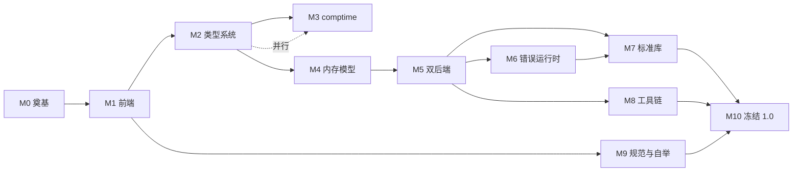

# 依赖关系与时间线

## 阶段依赖图

## 时间线假设

- **乐观**：全职投入 + 已有编译器/Rust 经验 + 聚焦不扩散
- **保守**：兼职投入 + 边学边做 + 允许打磨期

## 建议推进顺序

1. **严格串行**：M0 → M1 → M2。前端与类型系统是整个语言的地基，不建议并行。
2. **并行窗口**：M3（comptime）与 M4（内存模型）可在 M2 后半段并行启动；M6 与 M5 并行。
3. **里程碑节奏**：每阶段结束产出可演示的成果（M1 结束即有 `hc` 语法工具），保持动力与可验证性。

## 关键路径（乐观）

M0(1.5月) → M1(4.5月) → M2(6月) → M4(7月) → M5(8月) → M7(12月) → M9 部分(9月) → M10(9月)
≈ **48 个月（约 4 年）** 关键路径；并行优化后可压到约 3 年。

> **2026-08-13 评审校准（C1）**：乐观 3 年对应「0.x 可用」（可运行版本）；**1.0 的乐观估计 4–5 年、保守 5–7 年**——单人严肃语言项目（对标 Zig 9 年未 1.0、Rust 6 年）不宜把 1.0 估进 3 年。

## 发布节奏（1.0 之前）

参考 Zig 的节奏（约半年一个 minor）：**每 3–6 个月一个 0.x 版本**。0.10 前不承诺兼容性（Zig 式「冻结前允许破坏性变更」）；进入 M10 冻结期后切换为「无破坏性变更」政策。
