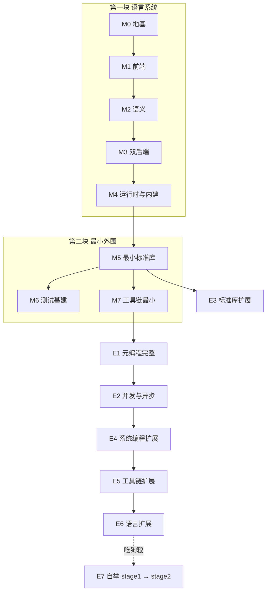

# H 语言实现计划（三块：语言系统 / 最小外围 / 扩展与自举）

> **结构**：本计划分三块——**第一块 = 语言系统**（语言本身的完整实现：前端、语义、双后端、运行时与语言内建机制，是「语言包」）；**第一块交付后语言即可解析、编译、运行自身核心**；**第二块 = 最小外围**（最小标准库、测试基建、基础工具链——与语言系统共同构成**第一部分「最小功能集」，不要求自举**）；**第三块 = 扩展功能 + 第一部分未完全完成的功能 + 自举**（**实现要求可自举**：用 H 语言编译 H 语言，stage0 Rust → stage1 H 重写 → stage2 闭环）。本计划为 `02-milestones.md`（1.0 里程碑）的功能拆分细表。

## 一、总体结构图

**三块模型**：
- **第一块 语言系统（M0–M4）**：Rust 实现语言本身——前端、语义、双后端、运行时与语言内建机制（`@` 内建、`box`/`copy`、序列化内建、标量接口族、`ExitType`、迭代内建）。**语言系统交付 = 语言可解析/检查/编译/解释全部语法**（含**脚本模式**——`hc run` 解释执行，双模式核心承诺，属 M3.2）
- **第二块 最小外围（M5–M7）**：最小标准库（四大支柱基础）、测试基建、基础工具链——与语言系统构成**第一部分最小功能集（不自举）**
- **第三块 扩展与自举（E1–E7）**：补齐**脚本生成（E1，`script` 块元编程）**、**多线程/并发/异步（E2）**、标准库/系统编程/工具链/语言扩展 + **自举**（stage1 渐进 → stage2 闭环）——**脚本生成与多线程仅在第三块实现，第一部分最小功能集明确不实现（最小例子不必实现）**

---

## 二、第一块：语言系统（M0–M4）

> **目标**：语言本身的完整实现（「语言包」）——从源码到可执行的全部编译/解释机制 + 语言内建能力。**验收**：全部示例可解析、语义检查通过、双模式运行一致；`@` 内建、序列化内建、标量接口族、迭代内建可用。

### M0 地基

| 模块 | 功能 | 详细说明 |
|---|---|---|
| M0.1 工作区 | cargo 三 crate | `hc`（编译器前端）/ `hc-rt`（运行时）/ `hc-tools`（工具链）；CI（lint + 快照测试 + 文档构建） |
| M0.2 基线 | 示例基线 | 全部示例（85 编号示例 + 86/87/88 + math.hc）→ token/AST/执行结果快照（每阶段回归基准） |

### M1 前端（lexer / parser / AST / 诊断 / 模块）

| 模块 | 功能 | 详细说明 |
|---|---|---|
| M1.1 Lexer | token 流 | 关键字全集（`class`/`enum`/`tree`/`interface`/`where`/`o`/`move`/`script`/`comptime` 等）+ `box`/`copy` + `@` 前缀内建；运算符全集（`%%`、`..`、`=>`、`\|x\|`、`\|\|`）；字符（`'x'` = u8）/字符串（`"..."` 转义 + `"""..."""` 多行原始）/数字字面量（惰性宽度 + 0x/0b/0o）；注释 `//` `///` `/* */`；全 token 带位置 |
| M1.2 Parser | AST 构建 | 表达式优先级表（Q4）；语句/声明；类型标注（`o`/`*`/`*mut`/`&[T]`/`&mut [T]`/`?T`/`E!T`/元组 `(T1,T2)`）；`where` 子句；switch（穷举 + 捕获 + else 兜底）；if/while 双向捕获（Q9/Q10）；`defer`/`errdefer`；`[test]` 特性标记（Q-R11）；`class`/`enum`（合一式）/`interface`（冒号标注）/`tree`/`namespace` |
| M1.3 诊断 | 错误报告 | 多错误收集、精确位置、颜色分级；接入 `@compileError` |
| M1.4 | 模块（**M1.4 完整**，2026-08-16） | `namespace`（跨文件/一文件多组）+ `using`（含 `as 别名`）+ 兄弟文件符号登记；**语义检查器跨文件符号**（`check_semantics_extern`：外部类型/函数/错误集/namespace 并入——限定名 `Orders.Line` 字段校验、`Math.square` 调用可查）；**using 导入**（语义 + 运行时：函数 + **类型** + 全局，扁平名直接可用，自身定义优先）；目录 = 包（test/run/check 加载同目录兄弟）；pub 解析保留（同包即达，跨包见 build.zon） |

### M2 语义（类型 + 所有权 + 错误集 + 函数）

| 模块 | 功能 | 详细说明 |
|---|---|---|
| M2.1 名称解析 | 符号表 | 作用域链、namespace 限定、泛型 T/where 绑定、**重载登记**（签名 = 函数名 + 参数类型列表 + 返回类型）、接口三用途 |
| M2.2 类型检查 | 类型系统 | 标量 + 接口族（`ICompare`/`INumber`/`IInt`/`IUint`/`IFloat`，内建实现）；**class 存储形态自动判定**（连续内存 vs 堆上）；枚举（任意负载、`@intFromEnum`/`@enumFromInt`）；元组（多值返回/解构）；`Table`；切片；可选；错误联合；指针（不可空）；**迭代契约 `IIterable` 三态**；**泛型 where 约束编译时验证**（接口限制运行时拆除） |
| M2.3 推断 | 推断优先 | 变量绑定/字面量惰性宽度/泛型 T/指针形态/返回类型推断（Q-S9）；参数与字段类型必须显式；重载歧义报错要求显式 |
| M2.4 所有权 | 来源判定 + 销毁 | 分配来源（非 Arena 默认当前作用域 / Arena 归 Arena / global 归根作用域）；作用域退出递归销毁（LIFO）；`move`（唯一约束 = 拥有所有权；原绑定仍可访问）；**引用类型赋值 = 编译错误**（显式 `copy(&x)`/指针）；`copy` 深/浅复制；global 初始化（程序启动、声明序 + 跨文件依赖拓扑排序） |
| M2.5 引用 | `*T`/`*mut T` | 不可空（Q16）；指针自由（多 `*mut`/`*T` 合法、可复制、指针问题用户负责）；Debug 悬垂标记（编译时选项，可选诊断）；**definite assignment（C7）：`alloc.init(T)` 无参构造 + 逐字段赋值的初始化状态跟踪——任何退出路径前全字段已赋值，否则编译错误** |
| M2.6 错误集 | 显式 / 推断 / anyerror | 显式错误集检查（Q13）；`!T` 推断收集（Q-S8）；`error.Name` 全局唯一；**错误码表**（编译器维护「名 ↔ 码」） |
| M2.7 函数 | 重载 / 可选参数 / 闭包 | 重载解析（参数精确匹配、返回类型上下文选择、歧义报错）；可选参数（尾部、编译期常量默认值）；闭包（只读/mut/move 捕获、按值返回规则） |

### M3 双后端（共享 IR + VM + LLVM）

| 模块 | 功能 | 详细说明 |
|---|---|---|
| M3.1 共享 IR | 唯一语义源 | 语义分析输出 IR；双后端共用，禁止各后端私语义（ADR-0004）；双模式一致性承诺的根基 |
| M3.2 VM | 字节码解释器 | 脚本模式（`hc run`）；作用域所有权 + defer + 错误处理 + 序列化内建 |
| M3.3 LLVM | 原生代码生成 | inkwell 绑定（锁定版本）；Release 裸路径零开销；静态链接默认（编译模式） |
| M3.4 一致性 | 双模式对照 | 同一程序两模式结果一致；一致性套件为 CI 硬门槛；`hc test --mode=compile` 交叉验证（Q-T5） |

### M4 运行时与语言内建

| 模块 | 功能 | 详细说明 |
|---|---|---|
| M4.1 内存运行时 | 作用域销毁 + 分配器机制 | 作用域退出递归销毁（LIFO）；分配器机制（显式传递 + 默认回退，每线程独立）；Arena 统一回收 |
| M4.2 错误/终止 | 错误码 + panic | 错误码运行时表示（码 + 成功标记，零额外负载）；`@panic("消息", 位置)` abort（Q-S2）；`ExitType` 退出映射 |
| M4.3 @ 内建基础集 | 编译期/转换 | `@sizeOf`/`@alignOf`/`@offsetOf`/`@typeOf`/`@intCast`/`@ptrCast`/`@alignCast`/`@compileError`/`@addWithOverflow` 等/`@intFromEnum`/`@enumFromInt`（Q-S1/Q-S6） |
| M4.4 数据内建 | box / copy / 序列化内建 | `box(value, alloc)`（装箱）/ `copy(&x)`（深/浅复制）编译器内建；**序列化 = 内建契约**——连续类型 `to_bytes`/`from_bytes`（直映射 + `packed`/`align` 尊重）、堆类型 `to_json`/`from_json`、集合 → 字节（u64 LE 前缀） |
| M4.5 标量接口族内建 | ICompare / INumber 族 | 内建标量自动实现 `ICompare`/`IInt`/`IUint`/`IFloat`（`i8–i128`/`isize`、`u8–u128`/`usize`、`f16–f128`）；运算符绑定（`a + b` ≡ `a.add(b)`）；String 内建实现 `ICompare` |
| M4.6 迭代内建 | IIterable 三态 | 数组/切片/Vec/Map/Table/String 内建实现 `IIterable(*T)`/`IIterable(*mut T)`/`IIterable(o T)`；`iter()` 显式迭代器对象 |
| M4.7 悬垂标记 | Debug 可选诊断 | 目标销毁时标记指向它的指针，访问提示带位置（编译时选项，非安全保证） |

---

## 三、第二块：最小外围（M5–M7）

> **目标**：与语言系统共同构成**第一部分最小功能集**（不自举）——最小标准库（四大支柱基础）、测试基建、基础工具链。**验收**：`hc build`/`hc run`/`hc test` 完整可用，示例套件双模式一致、测试全绿。

### M5 最小标准库（四大支柱基础）

| 模块 | 功能 | 详细说明 |
|---|---|---|
| M5.1 mem | Allocator / Arena 实例 | 默认分配器、Arena 类型与实例（分配器机制在语言系统 M4.1，此处为库类型） |
| M5.2 collections | 容器 | `Vec`/`String`（`u8[]` 别名）/`Map`/`Deque`（最小方法集：append/len/get/put/remove/迭代）；`Table` 构造 |
| M5.3 serialize 库 | 序列化封装 | 内建序列化（M4.4）之上的库封装与辅助（解析辅助、格式辅助） |
| M5.4 io 最小 | print / fs / net / 环境 | `io.print`（格式串）；`io.fs`（open/read/write/append/rename/remove/list_dir/**seek/pos/read_at/write_at**）；`io.net` 基础（TCP connect/listen/accept/帧读写）；**程序环境**（`io.args()`/`io.env(n)`/`io.stdin`/`stdout`/`stderr`/`io.exit(ExitType, code)`） |
| M5.5 时间/调试 | 基础工具 | `io.time.now()`/`sleep`；`debug` 断言（测试辅助） |

### M6 测试基建

| 模块 | 功能 | 详细说明 |
|---|---|---|
| M6.1 测试 | `[test]` 特性标记体系 | `[test]` 测试函数收集/运行；断言五件套（`expect`/`expect_eq`/`expect_neq`/`expect_error`/`expect_eq_slices`）；`[PASS]/[FAIL]/[SKIP]` + 汇总；失败非零退出码；`test_io`/`alloc` 注入；默认串行；双模式交叉 |

### M7 工具链最小

| 模块 | 功能 | 详细说明 |
|---|---|---|
| M7.1 命令 | `hc build` / `hc run` / `hc test` | build：编译包内全部文件（静态链接）；run：脚本模式单文件/包运行；test：M6 测试体系 |
| M7.2 包基础 | build.zon | 依赖清单 = H 数据字面量（`const build = Build{...}`）；单包 + 本地依赖；**指纹校验/注册中心 → 第三块** |

---

## 四、第一部分（最小功能集）明确不实现的功能

> **脚本生成与多线程在第三块（第二部分）实现——最小功能集明确不实现（最小例子不必实现）**。注意区分：**脚本模式（`hc run` 解释执行）= 双模式核心承诺，属第一块语言系统 M3.2（必须实现）**；**脚本生成（`script` 块元编程）= 第三块 E1（最小集不实现）**；**多线程/并发/异步 = 第三块 E2（最小集不实现）**。

- **脚本生成（`script` 块）**：types 元数据/就地替换/实时预览——第三块 E1 实现；第一部分仅泛型 where 基础（comptime 泛型）
- **comptime 完整**：`comptime { ... }` 块、类型即值/惰性实例化——第三块 E1
- **多线程/并发/异步全部**：四模式类型、线程、Future/async/await、通道、`Io.evented`、`@atomic` 原语——第三块 E2
- **标准库扩展**：UDP/HTTP、ipc、storage/archive、text、time 完整、rng、FFI（`extern fn`/`@cImport`/`hc cc`）
- **系统编程**：K1–K6/K7–K11 缺口、H core（freestanding）
- **工具链扩展**：LSP、format、lint、注册中心、供应链指纹校验
- **语言扩展**：惰性迭代、switch 守卫、Send/Sync 静态标记、并发测试
- **自举**（见第三块 E7）

---

## 五、第三块：扩展功能 + 未完成项 + 自举（E1–E7）

> **目标**：补齐第一部分未完成项 + 扩展功能；**本块实现要求可自举**——用 H 语言重写编译器并自举闭环。**验收**：`用 H 编译 H` 达成（stage2）。

### E1 元编程完整

| 模块 | 功能 | 详细说明 |
|---|---|---|
| E1.1 script 块 | 脚本生成 | `script { ... }`：隐式 `types` 元数据对象（`types.fields/type/all`，Q23）；产物 = 代码字符串就地替换；编辑器实时预览与校验；**错误机制统一**（脚本块失败 = 编译错误，带块内 + 所属块位置）；供应链指纹校验 |
| E1.2 comptime 完整 | 编译期求值 | `comptime { ... }` 块、泛型实例化完整（`fn List(T: type) type`）、类型即值、`anytype`、comptime_int/float 完整语义 |
| E1.3 序列化定制 | 脚本定制通道 | 脚本生成序列化/校验/存储样板（数据定义 → 样板，Q37/Q38） |

### E2 并发与异步

| 模块 | 功能 | 详细说明 |
|---|---|---|
| E2.1 四模式类型 | 共享内存容器 | `OneToOne/OneToMany/ManyToOne/ManyToMany`：write/read/try_read/close/send/recv；**缓冲语义**（共享内存无容量、通道有界 `init(alloc, cap)`）；单写者无锁路径 |
| E2.2 线程 | spawn/join/cancel | `spawn(f, args...) o Thread(T)`；join/cancel（协作式）/is_done/detach；线程所有权（作用域 → 根作用域提升）；捕获规则（值复制/move/global + Q18 绑定例外 + Q19 冻结窗口） |
| E2.3 异步 | Future/async/await | `async fn` → `Future(R)`；`await` ≡ `join()`（任何函数可用）；协作式取消；`Io.threaded()`/`Io.evented()`（单线程事件循环） |
| E2.4 原子 | @atomic | `@atomicLoad/Store/Rmw` + C11 五内存序；四模式内部实现基础 |

### E3 标准库扩展

| 模块 | 功能 | 详细说明 |
|---|---|---|
| E3.1 net 完整 | UDP / HTTP | `io.net.udp`（bind/send_to/recv_from）；HTTP 客户端/服务端 |
| E3.2 ipc | 进程间通信 | 管道、共享内存 |
| E3.3 storage/archive | 保存数据扩展 | 键值存储接口、数据库连接抽象、归档与压缩 |
| E3.4 text/time/rng | 工具扩展 | 文本处理（正则等）、时间与时区完整、伪随机数 |
| E3.5 ffi | C 互操作 | `extern fn` + `@cImport`（Q-S4：内建 C 解析器）；C 指针外置 + `box` 进入；错误码手动映射；`hc cc` |

### E4 系统编程扩展

| 模块 | 功能 | 详细说明 |
|---|---|---|
| E4.1 K1–K6 | 底层机制裁决与实现 | K1 无标签 union、K2 volatile、K3 内联汇编 asm、K4 `@ptrFromInt`/`@intFromPtr`、K5 `export fn` + 链接脚本、K6 freestanding（裸机模式）——1.0 范围裁决后实现 |
| E4.2 K7–K11 | 系统级类型 | 裸函数指针、位域、指针算术、`@byteSwap`、`Atomic(T)` |
| E4.3 H core | 无 OS 依赖子集 | K6 纳入时从 std 抽取（无 OS 依赖核心）；否则留 1.x |

### E5 工具链扩展

| 模块 | 功能 | 详细说明 |
|---|---|---|
| E5.1 LSP / format / lint | 质量工具 | 编辑器诊断（脚本实时预览通道复用）；格式化；lint |
| E5.2 包管理完整 | 注册中心 | 官方注册中心（自托管 MVP → 治理规则）；供应链审计；版本锁定 |

### E6 语言扩展（1.x 项 + 开放问题裁决）

| 模块 | 功能 | 详细说明 |
|---|---|---|
| E6.1 语言扩展 | 1.x 项 | 惰性迭代、switch 守卫、Send/Sync 静态标记、并发测试、`05` 开放问题 #1/#3/#4/#5/#6 裁决 |
| E6.2 吃狗粮反馈 | 语言成熟 | 编译器编写过程中暴露的语言缺口反馈回设计 |

### E7 自举（stage1 → stage2）

| 模块 | 功能 | 详细说明 |
|---|---|---|
| E7.1 H 重写 stage1 | 用 H 写编译器 | 渐进：H lexer → parser/AST → 语义（类型/所有权/错误集）→ 后端（IR/VM/LLVM）；与 Rust 版双实现对照（token/AST/执行结果对比，差异即 bug） |
| E7.2 自举闭环 stage2 | 用 H 编译 H | H 编译器（H 程序）用 stage1 编译自身；产物再编译产物（二次自举验证）；**可复现构建**（同源码同结果） |
| E7.3 规范一致性 | 规范 ↔ 实现 | 语言规范一致性测试（语法/语义/内存/并发）；Rust/H 双实现交叉验证 |

---

## 六、关键节点时间表（乐观）

| 节点 | 内容 | 里程碑产出 |
|---|---|---|
| T1（M0–M2 后） | 前端 + 语义完整 | `hc` 语法工具 + 语义检查（全部示例可解析） |
| T2（M3 后） | 双后端可运行 | 同一示例脚本/编译双模式运行一致 |
| T3（M4 后） | **语言系统完整** | **语言包可用：语法/语义/双后端/运行时/内建全部就绪** |
| T4（M5–M7 后） | **第一部分完成** | **最小功能集可用：`hc build`/`hc run`/`hc test` 完整**（不自举） |
| T5（E1–E2 后） | 元编程 + 并发完整 | 脚本生成/泛型完整；四模式/线程/异步可用 |
| T6（E3–E5 后） | 标准库 + 工具链完整 | 四大支柱完整；LSP/注册中心可用 |
| T7（E7 后） | **自举闭环** | 用 H 编译 H ✅（stage2） |
| T8（E6 + 冻结） | 1.0 冻结 | 1.0 checklist 全绿 |

## 七、与 02-milestones 的关系

- `02-milestones.md`：1.0 里程碑（M0–M10）与特性↔阶段映射——本计划的功能拆分是其实现细表
- **差异点（三块）**：第一块语言系统（M0–M4）≈ 02 的 M1–M6（前端/语义/双后端/运行时）；第二块最小外围（M5–M7）≈ 02 的 M7–M8 主体（标准库最小/工具链最小），**不含**脚本生成完整/并发完整/系统编程；第三块（E1–E7）承接脚本生成（M3 完整）、并发（M5）、系统编程缺口、自举（M9）与 1.x 项
- 自举（E7）为**第三块的实现要求**（可自举），不阻塞第一、二块（最小功能集）交付
- 两文档互相引用；里程碑验收以本计划功能模块为准绳

---

## 八、实现状态（tag1 垂直切片，2026-08-15）

> 项目根目录 `tag1/` 为第一阶段（最小功能集）首轮实现。**垂直切片范围**：全部 7 个里程碑的核心功能打通，非全量交付；余量按模块登记于下表（下一轮迭代补齐）。

### 已实现（✅）

| 里程碑 | 模块 | 说明 |
|---|---|---|
| M0.1 | cargo 三 crate 工作区 | `hc`（前端）/ `hc-rt`（运行时）/ `hc-tools`（CLI）；零外部依赖，可编译 |
| M1.1 | Lexer | 关键字全集、运算符（含 `%%`/`..`/`=>`/`|x|`/`||`/`^=`）、`@` 前缀、字符串/`"""` 原始串/字符、数字（进制+后缀+`_`）、注释、位置 |
| M1.2 | Parser + AST | 变量/常量/global/函数/`[test("名称")]`/class/enum/interface/namespace/using/特性标注 `[continuous] [pad] [align]`；if/while/for/switch/defer/errdefer；闭包；元组解构；错误集别名；`alloc.init` 双形态；尾随逗号；关键字变体/方法名 |
| M1.3 | 诊断 | 多错误收集、行/列位置、源码行指示 |
| M2.1 | 名称解析（**M2.1 完整**，2026-08-16） | 作用域链、函数登记（重载池）、类型登记、**接口三用途真实实现**（① implements 标注 = 方法契约验证，含超接口递归 ② where T: 约束调用点验证 ③ 编译可验证——签名兼容精确判定；内建接口 ICompare/INumber/IInt/IUint/IFloat/IIterable/Io 跳过契约检查） |
| M2.2 | 类型检查（**M2.2 完整**，2026-08-16） | 标量/String/数组/切片/元组/可选/错误联合/指针；**表达式级类型检查**（全部 Expr 变体静态推断）；**期望类型传播**（var 初始化/赋值/return/调用实参/二元运算/条件/迭代）；**字段与索引校验**（NamedLit 字段存在/必填/类型/未知、元组越界、Table 双整数索引）；**存储形态验证**（[continuous] 字段全值类型否则编译错误）；**运算符接口族检查**（算术→INumber、位→整数、序/等→ICompare）；**泛型 where 约束调用点验证**（标量→INumber 族、class→冒号标注接口） |
| M2.3 | 推断（**补全**，2026-08-16） | 变量绑定/字面量惰性宽度/返回类型推断；**泛型 T（经 *T 形参绑定具体化）、指针形态（&x 只读 / &mut x 可写）、多路径返回统一（一致通过 / 冲突报错要求显式）、重载歧义**（int 字面量 i32 精确胜 f64 兼容；i32/i64 同为精确 → 歧义；期望类型传播选返回类型；具体优先泛型） |
| M2.4 | 所有权（**编译时检查完整**，2026-08-16） | 分配来源判定（非 Arena 作用域注册 / Arena / global）、作用域 LIFO 销毁、`move` 标记（AST `Expr::Move` 保留）；**新增**：**分配来源跟踪**（VarInfo.source：None 值类型 / NonArena / Arena / Global / Unknown，按 init 形态+类型判定）；**move 合法性**（Arena/global/值类型无所有权 → 编译错误，对齐 C④）；**引用逃逸（Q18）**（`return &局部/参数` → 编译错误，带所有权参数须 `return move`；global 引用放行）；引用类型赋值禁止 / copy 深浅复制保留 |
| M2.7 | 函数 | 重载（**具体优先于泛型**）、可选参数（尾部默认）、闭包（只读/mut/**move** 捕获、**按值返回规则**、**捕获精确化（2026-08-17）：自由变量精确分析（只捕获 body 实际引用，含嵌套传递）+ 非 mut 只读强制（重绑定捕获 → ReadonlyCapture）+ move 深拷贝（Str/Closure）**） |
| M2.6 | 错误码表（**M2.6 完整**，2026-08-16） | 编译器维护「错误名 ↔ 码」全局唯一映射（`hc/src/errorcodes.rs`）；**编码 = 高位 16 位包 ID + 低位 16 位包内序**（L5 定案，跨包不冲突）；每错误记录**首次出现位置**（span）——错误报告以原始错误位置为前提（不输出调用链）；三类来源全收集（错误集声明成员 / `error.X` 字面量 / switch 模式）；`hc errors <file>` 输出表；**错误传播模型**：函数声明错误联合（`E!T`/`!T`）→ `error.X` 沿**值通道**传播直到 `try`/`catch` 处理（try 不转抛错通道，catch 全链可拦截）；**未标记错误类型**（返回值非错误联合）`return error.X` → 编译错误；未处理错误到根作用域 → 记录错误名位置输出（`error.Name at 行:列`）→ panic 式中止（非零退出，无恢复）；**`!T` 推断收集（Q-S8）**：编译器从函数体收集 `return error.X` + `try`/`return` 传播的实际返回集（固定点闭包，显式 `E!T` const 集并入）；递归自调用无法收集 → 退化为 anyerror + warning 提示显式标注（`hc::inferred_error_sets`） |
| M3.1 | 共享 IR（**已落地**，2026-08-16） | `hc/src/ir.rs`：线性指令 + 标签形态（`IrInst`/`IrConst`/`IrBinOp`），AST→IR 降级 `lower` + 参考解释器 `run_ir`（双后端共同语义源，ADR-0004）；覆盖：标量运算/比较/短路 `and or`/if（语句 + 表达式 + else-if + optional 捕获 `|v|`）/while（含续步 `(i += 1)`）/return/try/catch（默认值 + 绑定块值，块值只求值一次）/orelse/error 字面量/全局与命名空间调用（多级限定名 `io.net.connect` 展平）/断言内建；**作用域槽分配**（块退出恢复外层绑定）、**复合赋值** `x += 1`、**checked 算术**（溢出 `Overflow`、除/模零 `DivisionByZero`，与 tree-walking arith 一致）；错误值走值通道（try 返回 / catch 拦截）；**Phase 1 指针（2026-08-16）**：`Cell/Ctx/Frame` 堆/单元模型（每槽持稳定 cell——别名装置，对齐 tree-walking `Rc<RefCell>`）、`IrValue::Ptr`、`AddrSlot`（`&x`/`&mut x` 取址别名）/`AddrValue`（`&非lvalue` 快照）/`Deref`（`p.*`，非指针恒等）/`StorePtr`（`p.* = v`，非指针 → `BadAssign`）四指令、`value_eq` 指针身份/解引用比较、`value_lt` 指针按 cell 序；**Phase 2 聚合（2026-08-16）**：`Field/StoreField`（`.` 字段 + `.len` 内建字段）、`Index/StoreIndex`（单索引）、`SliceOf/StoreSlice`（`a[lo..hi]` 视图/写回）、`MakeArr/MakeClass/MakeEnum`（数组/元组/struct 字面量、类型名限定枚举常量）、`Destructure`（元组解构）、`Move`（值拷贝）、`Unwrap`（`x.?` 解包）、`TypeTable`（class/enum/interface/namespace 元数据）+ `value_eq` 深比较（Arr/Slice/Class/Enum）；**Phase 3 switch + range + for（2026-08-17）**：`MatchTest`/`IrPattern`（int/float/str/char/bool/ident/null/error 模式；switch 降级为 **first-match 线性链**——不穷举检查，对齐 `interp.rs:1289-1361`）、`MakeRange`（`0..n` 区间糖 → 数组，`cnt = max(0, hi-lo)`）、`EnumPayload`（switch 捕获枚举负载）、`IterMake/IterNext/IterWriteBack`（for 迭代：Arr/Slice 元素 cell `is_ref=true` 保留别名写穿、Str→字节新 cell、Map→KV 新 cell、用户 IIterable→`next()` 至 `Opt(None)`、其他 → `NotIterable`）、`lower_switch`/`lower_for`/`lower_break`/`lower_continue`（无标签 break/continue 经 `loops: Vec<LoopCtx>` 定位）；**Phase 4 闭包/函数引用/方法/动态调用/重载（2026-08-17）**：`MakeClosure`（捕获存 **cell 索引**——读/mut 捕获共享 cell 写穿、move 捕获 `deep_copy` 新 cell，返回闭包跨帧存活；闭包 func 参数 = [捕获, 显式参数]）、`FnRef`/`CallIndirect`（函数引用与动态调用）、`CallMethod`（`deref_value` 基座 + self 前置注入 + `"{Type}.{method}"` 限定名查表——实例方法动态分派由类型名 key 自然得出；静态 `Rect.area(&r)` 走 `Call` 显式 self 不注入）；**func_index 重载化**：`HashMap<String, Vec<usize>>` 一名多候选，`pick_func` ①arity 精确过滤 ②实参类型匹配（具体优先泛型）③默认参兜底（对齐 `pick_fn` `interp.rs:2665-2796`）；**Phase 5 global/const（2026-08-17）**：`LoadGlobal`/`StoreGlobal`/`GlobalAddr`（`&global` 别名写穿）+ 合成 `@__init__`（声明序初始化）+ `IrRuntime`（全局 cell 跨调用/跨测试共享）；**Phase 6 defer/errdefer + 带标签 break/continue（2026-08-17）**：`PushDefer`/`JumpIfNotDefer`/`PopDefer`（per-id 活跃计数器 flag 模型——编译期发射序保证 LIFO，errdefer 交错无栈洞）、作用域 marker 发射（`pop_scope` 射到 marker + truncate、`return`/`break`/`continue` 按 `ErrPath` 射到 0/循环入口深度：`Never` 正常结束非 errdefer 守卫发射 + errdefer bare-PopDefer 清理、`Always` try 错误传播全跑、`Value` 返回值 JumpIfErr 拆分）、标签循环栈（`:label` 前缀 + `break :label`/`continue :label` 跨层定位 + `defer_depth_at_entry` 排空循环体 defers）、`Frame.defers` 运行期活跃多重集；**Phase 8 闭包捕获精确化（2026-08-17）**：`MakeClosure.captures` 对齐自由变量集合（`hc/src/ast.rs` `closure_free_vars` 驱动——scope-stack-aware + flow-sensitive AST 遍历，嵌套闭包参数入栈、transitive 下钻）、只读强制 IR/原生生效（`Frame.readonly` 槽集 + Store 检查 → `ReadonlyCapture`）、`move` 深拷贝补 Closure（MakeClosure 时递归复制捕获 cell）、修 `lower_closure` 两 bug（func_idx 在 body 降级后取 + else 分支不重复降级末语句）；不做（记录扩展）：Table 多索引（M8） |
| M3.2 | 字节码 VM（**已落地**，2026-08-16） | tree-walking 解释器（`hc run`，全语言脚本模式）为默认；**字节码 VM**（`hc/src/bytecode.rs`）：`IrModule` 序列化（HBC2：魔数 + version + 函数索引表 + 函数/指令流；i128/f64 全精度、字符串长度前缀、函数索引表按名排序保编码确定性）+ `decode` 装载 + `run_bytecode` 复用 `run_ir`（ADR-0004 唯一语义源，不另写 dispatch 循环）；**CLI**：`hc run <file.hbc>` 自动识别 HBC2 → 字节码 VM（与 `hc run --ir` 共用 `execute_ir` 归一化）；`hc build` zig 缺失回退产出真实 HBC2 `.hbc` + 启动器（替代 HBC1 源码壳，旧 HBC1 读取兼容保留）；覆盖 M3.1–Phase 6 切片（标量/短路/if/while/for/switch/闭包/函数引用/实例方法/重载/global/const/defer/errdefer/带标签 break/continue/return/try/catch/orelse/error/限定名调用/断言内建；HBC2 VERSION 5：opcode 0–46 含 Phase 3 六指令 + MakeClosure/FnRef/CallIndirect/CallMethod 四指令（**MakeClosure 编码 = temp + func + n_captures + {name,slot}×n + is_move 字节 + is_mut 字节**）+ Phase 5 三指令（LoadGlobal/StoreGlobal/GlobalAddr）+ Phase 6 三指令（PushDefer/JumpIfNotDefer/PopDefer）+ 全局表；闭包表 = u32 n_closures + 函数 × n_closures） |
| M3.4 | 双模式一致性（**已落地**，2026-08-16） | `hc-rt/tests/consistency.rs`：同一程序分别经 **tree-walking 解释器**（脚本模式）与 **IR 参考解释器**（`run_ir`，M3.1 唯一语义源）运行全部 `[test]` 测试函数，PASS/FAIL 必须完全一致（ADR-0004 承诺根基，CI 硬门槛）；结果归一化：IR `Ok(非错误)` = PASS、`Ok(错误值)` = FAIL（M2.6 未处理错误到根 panic 式失败）、`Err` = FAIL；覆盖 M3.1–Phase 8 全语言双模式一致（标量/短路/if 三形态/while 续步/递归/try/catch/orelse/error 字面量/断言/限定名调用含多级 namespace/作用域遮蔽/复合赋值/除零溢出 + Phase 1 指针别名 + Phase 2 聚合 + Phase 3 switch/range/for + Phase 4 闭包/方法/重载 + Phase 5 跨 test fn 可变全局 + Phase 6 defer/errdefer/带标签 break/continue + Phase 7 全核心标准库 + Phase 8 闭包捕获精确化/只读强制/move 深拷贝）；**一致性驱动的运行时修复**：① tree-walker 块值缺漏——`exec_stmt` 丢弃末位表达式值导致 catch 块值/块表达式恒 void（改为末位表达式产生 `Flow::Value`，语句位 if/块丢弃防早退）；② tree-walker 多级 namespace 限定调用未查函数表（eval_call Field 分支先查扁平限定名，与单级 Dot 形态一致）；③ **Phase 6 oracle 修复（先修 oracle，IR 再对齐）**——errdefer 仅错误路径触发（`pop_scope`/`run_defers` 传 `err_path`，`is_err_path` 判定错误信号/错误值）、defer 同作用域捕获读到「退出时最终值」（`pop_scope` 先取走 defers 在作用域仍压栈时执行再弹栈）、带标签 break/continue 按名跨层定位（`Flow::Break/Continue(Option<name>)`，循环消费仅匹配自身标签、否则向上一级传播） |
| M4.3 | @ 内建（基础集完整，2026-08-16） | `@` 前缀 token 解析；**@sizeOf**（标量/连续 class 布局与 to_bytes 一致/枚举/引用类型=指针宽）、**@alignOf**（自然对齐）、**@offsetOf**（连续字段偏移含填充）、**@typeOf**（类型名）、**@intCast**（Debug 范围检查溢出抛错）、**@ptrCast**/@alignCast（透传）、**@compileError**（编译期错误拦截）、**@addWithOverflow**/@sub/@mul（(T,bool) 元组）；@intFromEnum/@enumFromInt/@panic 已有 |
| M4.2 | 错误码运行时表示（**M4.2 完整**，2026-08-16） | **`Value::Err { name, code }`**（码 = M2.6 表「包 ID + 包内码」，全局唯一；运行时未登记错误名动态分配——anyerror 任意码）；比较/匹配/断言走码或名；**根作用域报告带码**（`error.NotFound (0x00000000) at 1:6`）；`@panic`/`ExitType`/`io.exit` 已有；成功路径零额外负载（值枚举无 Err 开销） |
| M4.4 | 序列化内建（**补全**，2026-08-16） | `to_bytes`/`from_bytes`（连续类型直映射、**packed/align 尊重**、集合 u64 前缀）、`to_json`/`from_json`（class/Map、**堆类型完整**）、`box` 装箱 |
| M4.5 | 标量接口族（**补全**，2026-08-16） | 内建标量自动实现 `ICompare`/`INumber`/`IInt`/`IUint`/`IFloat`；**运算符绑定**（`a + b` ≡ `a.add(b)`）；**完整方法族**（add/sub/mul/div/neg/mod/abs/eq/lt 等）；String 内建实现 `ICompare` |
| M4.6 | 迭代内建（**补全**，2026-08-16） | **IIterable 三态**（`IIterable(*T)` / `IIterable(*mut T)` / `IIterable(o T)`）；数组/切片/Vec/Map/Table/String 内建实现；**`iter()` 显式迭代器对象**；`filter()/map()` 立即求值链 |
| M5.1 | mem | `Arena.init`、`arena.alloc(n)`、`alloc.alloc(n)` |
| M5.2 | collections（**Deque 补全**，2026-08-16） | `Vec`（append/len/iter/from_bytes）、`Map`（put/get/contains/remove/len/遍历）、String 方法集（concat/split/join/find/substring/replace/as_slice/to_bytes）、**`Deque` 双端**（push_front/back、pop_front/back、front/back、get/put/remove——越界 `IndexOutOfBounds` / 空返回 null，共享 `Value::Arr` 值模型） |
| M5.4 | io 完整（**M5.4 完整**，2026-08-16） | `io.print` 格式串；`io.fs`（open/create/read_file/read_all/write_all/append/remove/rename/list_dir/read_int/write_int + **seek/pos/read_at/write_at**）；**`io.net` TCP**（connect/listen(0 端口)/local_port/accept 阻塞/write/read(n)/read_all/shutdown/close + **u32 LE 帧读写** read_u32_le/write_u32_le）；程序环境（args/env/stdin 读一行/stdout/stderr/io.exit(ExitType, code)） |
| M5.5 | 工具 | `io.time.now()`（毫秒）/`sleep`（ms）；`sort`（含比较器闭包）、`binary_search`、`sqrt`、`math` 命名空间、`parse_int`/`parse_float`、parser 辅助内建 |
| M6.1 | 测试 | `[test("名称")]` 测试函数收集运行（显示名 = 名称 ?? 函数名）；断言五件套；`[PASS]/[FAIL]/[SKIP]` + 汇总；失败非零退出码；`test_io`/`alloc` 注入 |
| M7.1 | CLI | `hc run`（tree-walking 全语言）/ `hc run <file.hbc>`（字节码 VM，M3.2）/ `hc run --ir`（IR 参考解释器）/ `hc test`（含 `--mode=compile` 原生交叉验证，Q-T5）/ `hc check` / `hc build`（**同目录 = 包，多文件合并静态链接**；原生 LLVM；zig 缺失回退 HBC2 字节码 + 启动器） |
| M7.2 | build.zon 包基础（**已落地**，2026-08-16） | `build.zon` 清单解析（`hc-tools/src/buildzon.rs`：`const build = Build{ name, version, kind, files, deps }` 数据字面量 → Manifest，含尾逗号数组/十六进制 fingerprint/`Kind.exe/lib/script`）；**pub 边界过滤**（AST `Decl`/`FieldDecl` 加 `pub` 字段；语义 `collect_decl_prefixed_filter` + 运行时 `register_*_filter`/`exec_decl_top_filter` 跨包仅登记 `pub` 项）；**本地依赖装载**（`Interp::load_dep` + `hc check/run/test` 经 `load_manifest_deps_into`/`load_deps_into` 递归装载带 `path` 的依赖、visited 防环；无 path 注册中心依赖告警跳过）；`using pkg.xxx` / `pkg.xxx` 跨包访问；示例 `tag1/examples/02-packages/` |
| **M2.2+** | **语义检查器**（2026-08-15 梯队 1） | 静态 pass（`hc/src/semantic.rs`，load 前运行）：**标量宽度检查**（`var g: u8 = 256` 编译期报错）、**引用赋值禁止**（`var w: Vec(i32) = v` 报错——要求 `copy(&v)` 或指针）、连续类型赋值放行、**错误集成员检查**（return `error.X` 必须属于函数错误集）、**definite assignment（C7）**（`alloc.init(T)` 无参构造后字段未全赋值即 return → 编译期报错）、类型元数据收集 |
| **M4.3+** | **@ 内建补充**（2026-08-15） | `@intFromEnum`/`@enumFromInt`（变体序 ↔ 枚举，M4.3 子集） |
| **M8** | **Table 类型**（2026-08-15） | `Table(T).init(alloc, rows, cols, init)` 构造 + `t[i, j]` 多参索引（仅 Table 合法） |
| **L1** | **copy 浅复制**（2026-08-15） | `copy(&x, .shallow)`（CopyMode 内建枚举，`.name` 推断枚举字面量）；默认深复制不变 |
| **L1** | **`.name` 推断枚举字面量**（2026-08-15） | `copy(&x, .shallow)` ≡ `copy(&x, CopyMode.shallow)` |
| M2.5 | **definite assignment（C7）**（2026-08-15 收尾） | `alloc.init(T)` 无参构造跟踪待初始化字段集；字段赋值逐一消除；return 时缺失字段 → CompileError（修复 Dot/Field 解析形态差异） |
| M2.5/M4.7 | Debug 悬垂标记（**已落地**，2026-08-16） | `&x` 登记目标 cell；**作用域退出 = 目标销毁 → 目标 cell 内容标记 `Value::Dangling`**（有指针持有的 cell 不释放、地址唯一——无地址碰撞误判）；解引用访问（`d.*`/`p.x`/`s[i]`/写路径）已标记 → `DanglingPointer` 抛错**带位置**；`debug_dangling` 开关（Debug 默认开，Release 裸读用户负责）；取指针不抛错（Q18） |

**测试基线（2026-08-17）**：`hc` 前端 **35** + lib 单测 **31**（bytecode 往返/坏格式 + llvm.rs 纯文本发射，含 Phase 1–6 指令 codegen 文本） + **bytecode 集成 27**（VM==参考一致性 + opcode 0–46 全量往返夹具，含 Phase 5/6 六新指令） + **IR 63**（M3.1 + Phase 1 指针 + Phase 2 聚合 + Phase 3 switch+for + Phase 4 闭包方法重载 + Phase 5 全局 + Phase 6 defer/errdefer/带标签 直接断言） + **inferred_errors 6** + `hc-rt` errors **18** + semantics **47** + **一致性 56**（M3.4 全语言 + Phase 1 指针 + Phase 2 聚合 + Phase 3 switch/range/for + Phase 4 闭包/方法/重载 + Phase 5 跨 test 可变全局 + Phase 6 defer/errdefer/带标签 break/continue 双模式 PASS/FAIL 一致） + io **6** + iter **4** + interfaces **10** + deque **4** + inference **11** + closures **4** + scalar **2** + serialize **4** + dep **3** + examples **41** + `hc-tools` 单测 **20** + native **36**（zig cc 端到端，含 Phase 2 聚合 + Phase 3 switch/for + Phase 5 全局 + Phase 6 defer/errdefer/带标签 原生）全绿——`cargo test --workspace` **428** 全绿；`hc test examples/` 全目录 **125/136 通过**（11 失败分属第三块 E1/E2 特性，见下）。

> **2026-08-15 梯队 1 更新**：语义检查器（宽度/引用赋值/错误集成员/definite assignment）、`@intFromEnum`/`@enumFromInt`、Table 类型、copy 浅复制、`.name` 推断枚举均已落地。

> **2026-08-16 梯队 2 更新（M2.2 完整）**：表达式级类型检查 + 期望类型传播 + 字段/索引校验 + 存储形态验证 + 运算符接口族检查 + 泛型 where 约束调用点验证全部落地（`hc/src/semantic.rs` 重写为完整静态类型检查器；AST/parser 保存 where 子句）。示例回归 **122/134 与基线一致**；已知取舍：`ex46_recursion` 栈溢出（tree-walking 递归深度）与 12 个 E1/E2 失败保留。

> **2026-08-16 梯队 3 更新（M2.6 错误码表）**：「错误名 ↔ 码」表 + 包 ID/包内码编码 + 首次出现位置 + `hc errors` 命令 + 根作用域错误报告（`error.Name at 行:列` + panic 式中止）全部落地（`hc/src/errorcodes.rs`；`interp.rs` 根作用域处理）。前端单测 13→22、errors 7→9；示例回归不变。

> **2026-08-16 梯队 3b 更新（错误传播模型收尾）**：按定案——**标记错误联合**（`E!T`/`!T`）的函数：错误沿**值通道**传播直到 `try`/`catch`（修复 `try` 转抛错通道绕过 catch 的缺陷——`try` 改 signal 值返回，`catch` 全链可拦截）；**未标记错误类型**：非错误联合函数 `return error.X` → 编译错误（`semantic.rs`）；未处理错误到根（main/测试根）→ 记录位置 + panic 式中止/记 FAIL。errors 7→14；示例回归 122/134 不变。

> **2026-08-16 梯队 4 更新（M2.4/M2.5）**：**M2.4 所有权编译时检查**——分配来源跟踪（VarInfo.source）+ move 合法性（Arena/global/值类型禁止，对齐 C④）+ 引用逃逸 Q18（`return &局部/参数` 禁止，带所有权参数须 `return move`）落地（`semantic.rs`；AST 保留 `Expr::Move`）；**M2.5/M4.7 Debug 悬垂标记**——`&x` 登记、作用域退出把目标 cell 标记 `Value::Dangling`、解引用访问抛 `DanglingPointer` 带位置、`debug_dangling` 开关（Release 裸读）落地（`interp.rs`/`value.rs`；cell 内容标记方案无地址碰撞）。前端单测 22→29、semantics 37→40；示例回归 122/134 不变。

> **2026-08-16 梯队 5 更新（M4.2 错误码运行时表示）**：`Value::Err` 从字符串迁移为 **`{ name, code }`**（码 = M2.6 编译期表；运行时未登记错误名动态分配）；错误比较/匹配/断言走码；根作用域报告带码（`error.NotFound (0x00000000) at 行:列`）；`@panic`/`ExitType`/`io.exit` 保持。errors 14→17；示例回归 122/134 不变。错误系统闭环：编译期表（M2.6）↔ 运行时值（M4.2）一致。

> **2026-08-16 梯队 6 更新（M4.3 @ 内建基础集）**：@sizeOf/@alignOf/@offsetOf（连续类型布局与 to_bytes 一致——可验证直映射）、@typeOf、@intCast（Debug 溢出检查）、@ptrCast/@alignCast（透传）、@compileError（编译期拦截）、@addWithOverflow 三件套落地（`interp.rs` call_builtin + `semantic.rs` call_at_builtin）。semantics 40→47；示例回归 122/134 不变。

> **2026-08-16 梯队 7 更新（M5.4 io 完整）**：**io.net TCP 基础**（connect/listen/local_port/accept/write/read/read_all/shutdown/close + u32 LE 帧读写）、**fs seek/pos/read_at/write_at**（create 改读写权限）、**io.stdin** 落地（`interp.rs` call_net_method/call_conn_method/call_listener_method）；`io.time.now/sleep` 核实已实现（M5.5 一并落地）。新增 `hc-rt/tests/io.rs` 6 测试；示例回归 122/134 不变。

> **2026-08-16 梯队 8 更新（M1.4 跨文件模块）**：**语义检查器跨文件符号**（`check_semantics_extern`——兄弟文件类型/函数/错误集/namespace 并入，限定名 `Orders.Line` 字段校验与 `Math.square` 调用可准确检查，`semantic.rs` collect_decl_prefixed 双登记）；**using 导入补齐**（语义 + 运行时 collect_using：函数 + 类型 + 全局，`as 别名`，扁平名直接可用）。前端单测 29→33；示例回归 122/134 不变（41/43/44 多文件示例通过）；运行时验证 using 导入类型直接引用 + 限定调用。

> **2026-08-16 梯队 9 更新（M3.1 共享 IR）**：`hc/src/ir.rs` 线性 IR + 参考解释器落地（`lower`/`run_ir` 导出）——标量/短路/if（else-if、表达式、optional 捕获）/while（续步）/try/catch/orelse/error 字面量/限定名调用（多级 `io.net`）/断言内建；作用域槽分配（块退出恢复外层绑定）+ 复合赋值 + 块值单次求值，语义对齐 tree-walking 解释器；错误值走值通道（try 返回/catch 拦截）。新增 `hc/tests/ir.rs` 22 测试；示例回归 122/134 不变。IR 为唯一语义源（ADR-0004），M3.2 VM 与 M3.3 LLVM 共用；break/continue/for/switch/defer 不在 IR 范围（记录扩展）。

> **2026-08-16 梯队 10 更新（M3.4 双模式一致性）**：一致性套件 `hc-rt/tests/consistency.rs`（14 测试）落地——同一程序 tree-walking 与 IR 参考解释器全 test fn PASS/FAIL 必须一致；**套件捕获两处 tree-walker 缺陷并修复**：① **块值缺漏**——`exec_stmt` 丢弃末位表达式值，catch 绑定块/块表达式恒 void（IR 按规范返回末位表达式值）→ `exec_block_inner` 末位表达式语句产生 `Flow::Value`，语句位 if/块丢弃防中间语句早退（示例回归 122/134 不变）；② **多级 namespace 限定调用**——`io.net.double` 解析为 Field 形态，eval_call 从未查函数表（单级 `Math.square` 为 Dot 形态可用）→ Field 分支先展平查表（`qualified_flat_name`），与 IR 展平降级一致。另对齐 `binop` checked 语义（溢出 Overflow / 除模零 DivisionByZero，与 tree-walking arith 一致）。新增一致性 14 测试；示例回归 122/134 不变。

> **2026-08-16 梯队 11 更新（IR 接入 `hc run --ir`，M3.2 字节码 VM 过渡形态）**：显式模式标志 `hc run --ir <file>` 用 **IR 参考解释器**（`run_ir`，M3.1 唯一语义源）替代 tree-walking 执行（`hc-tools/src/main.rs`，核心抽成 `run_ir_source`——不依赖文件系统/退出码，可单测）。**执行流程**：解析 → 语义检查（准确优先：能精确判定才报错，与 tree-walking load 内建检查对齐）→ `lower` → 查 `func_index` 有 `main`（无 → NoMain）→ `run_ir(module, "main", [])`；**切片范围 = M3.1 切片**（标量/短路/if/while/return/try/catch/orelse/error 字面量/限定名调用/断言内建），**不支持** io/集合/class/闭包/指针/for/switch/defer/break/continue/全局变量；**main 入口**：零参 `main` 可完整运行，`main(io: Io)` 的 io 参数为 Void 占位（用 io.* 走 NoFunction + 提示，正常）；**根错误映射**：`Ok(Err)` → `error.X 到达入口（未处理）` 非零退出（panic 式失败，无恢复）、`Ok(_)` → 成功（退出码 0，main 返回非零 Int 不影响）、`Err(IrError)` → `error.{name}: {message}` 非零退出（NoFunction/TypeError 追加「程序使用了 IR 切片外特性（io/集合/指针等）——请用默认 tree-walking 模式 hc run <file>」提示）；**默认 `hc run`（无 `--ir`）tree-walking 路径零改动**。新增 `hc-tools` 单测 8 个（切片内成功含 if/while/try/catch、main(io) Void 占位、未处理错误、除零、NoMain、切片外 io.print 提示、解析诊断）；示例回归 122/134 不变。

> **2026-08-16 梯队 12 更新（M2/M4 子集补全 + M2.6 `!T` 推断收集）**：按「M2/M4 子集补全」范围逐项落地——① **M4.6 迭代内建补全**（IIterable 三态 `*T`/`*mut T`/`o T` + Vec/Table 迭代 + `iter()` 显式迭代器对象）；② **M4.5 标量接口族**（运算符绑定 `a + b ≡ a.add(b)` + ICompare/INumber/IInt/IUint/IFloat 完整方法族，String 实现 ICompare）；③ **M4.4 序列化内建**（packed/align 尊重 + 堆类型 json 完整 + box）；④ **M2.7 闭包**（move 捕获 + 按值返回规则）；⑤ **M2.3 推断补全**（泛型 T 经 *T 形参绑定、指针形态、多路径返回统一、重载歧义——i32 精确胜 f64、i32/i64 同精度歧义、期望类型传播、具体优先泛型）；⑥ **M2.1 接口三用途真实实现**（implements 契约验证含超接口递归 + where 约束 + 签名兼容精确判定，内建接口跳过）；⑦ **M5.2 Deque 运行时**（push_front/back、pop_front/back、front/back、get/put/remove，越界 `IndexOutOfBounds` / 空 null，共享 `Value::Arr`）；⑧ **M2.6 `!T` 推断收集（Q-S8）**（`hc::inferred_error_sets`：从函数体收集 `return error.X` + `try`/`return` 传播固定点闭包，显式 `E!T` const 集并入；递归自调用 → 退化为 anyerror + warning 提示显式标注）。**测试基线**：新增 `hc/tests/inferred_errors.rs` 6（直接收集/传播/显式并入/递归退化/互递归）、`hc-rt/tests/interfaces.rs` 7、`hc-rt/tests/deque.rs` 4、`hc-rt/tests/inference.rs` 补 5、`hc-rt/tests/closures.rs` 4、`hc-rt/tests/scalar.rs` 2、`hc-rt/tests/serialize.rs` 4；hc 前端 33 + IR 22 + inferred_errors 6 全绿；hc-rt 非 examples 全绿（errors 18 / semantics 47 / consistency 14 / io 6 / iter 4 / interfaces 7 / deque 4 / inference 11 / closures 4 / scalar 2 / serialize 4）；`ex46_recursion` 栈溢出仍为已知红项。**第一部分剩余缺口**：M3.3 LLVM 原生后端、M3.2 字节码 VM（见「未实现」表）。

> **2026-08-16 梯队 13 更新（M7.2 build.zon 包基础 + pub 边界过滤）**：按「M7.2 包基础」范围落地——① **ArrayLit 尾逗号**（`parser.rs` 镜像 TupleLit 尾逗号处理，`[1, 2, ]` 合法——build.zon 的 `files`/`deps` 数组带尾逗号）；② **AST pub 字段**（`Decl::{Global,Const,Fn,Class,Enum,Interface,Namespace}` 与 `FieldDecl` 加 `pub`；`Decl::is_pub()`；类方法默认公开、类字段默认私有不变）；③ **解析器保留 pub**（顶层 `pub` 声明 + 类体 `pub` 字段/方法；`script` 关键字名可解析）；④ **语义侧依赖收集**（`check_with_extern_deps`：同包兄弟 `collect` 全可见 + 依赖包 `collect_dep` 以包名前缀登记、`collect_decl_prefixed_filter` 的 `skip_flat` 抑制扁平名 + `pub_only` 过滤非 pub 项；`hc::check_semantics_extern_deps`）；⑤ **运行时依赖装载**（`Interp::load_dep`：`dep_programs` + `register_type/fn_decl_prefixed_filter` pub+前缀 + `exec_decl_top_filter` pub 全局/常量；不注入 ExitType/不 apply_usings/不 record_error_locs——错误集包隔离）；⑥ **build.zon 解析**（`hc-tools/src/buildzon.rs`：`Manifest`/`Kind`/`Dep`，`parse`/`load_from_dir`，十六进制 fingerprint 复用 `hc_rt::parse_int_text`）；⑦ **CLI 接线**（`hc check/run/test` 经 `load_manifest_deps_into`/`load_deps_into` 递归装载带 `path` 的本地依赖、visited 防环，无 path 注册中心依赖告警跳过；`hc build` 打印包/文件/依赖信息——LLVM 仍归 M3.3）。**测试**：新增 `hc-rt/tests/dep.rs` 3（跨包限定/using 平铺/非 pub 不可见/namespace 前缀）+ `hc-tools` buildzon 5；示例 `tag1/examples/02-packages/`（app 依赖 ../jsonlib，`using jsonlib;` 跨包调用 + `fn secret` 私有不可见）。**基线**：示例回归 **120/134 不变**——14 失败中 12 属 E1/E2/接口错误契约，另 **25/26 为跨文件泛型 `load_config` 重载碰撞**（同目录两文件同名泛型函数经兄弟加载双登记 → 「ambiguous call」CompileError，b538e4a 起既存，非本轮回归）。

> **2026-08-16 梯队 14 更新（M3.3 LLVM 原生后端）**：`hc build` 从字节码镜像占位升级为**原生编译**——emit-.ll 文本 + `zig cc` 驱动（`hc/src/llvm.rs` 纯字符串发射，零外部依赖；LLVM 18 缺 llvm-config 故弃 inkwell，用户裁定 zig cc）。**值表示**：统一带标签盒 `%Value = { i32 tag, i64 data }`（tag ∈ {void/null/int/float/bool/str/err}，float 载荷 bitcast、str 载荷 i8*、err 载荷错误码），正确性优先对齐 `exec_func` 动态语义；**动态运算**集中到导言 helper（`@hc_add/sub/mul/div/mod/eucmod/bitand/bitor/bitxor/shl/shr/eq/lt/truthy/is_err/is_null/neg/not/bitnot`，溢出经 `llvm.s{add,sub,mul}.with.overflow.i64` 检查；`@hc_eq`/`@hc_lt` 用 select 守卫 strcmp 避免解引用非串指针）；**错误值通道**（`error.Name` = tag 6 值）与硬错误（Overflow/DivisionByZero/NoFunction/TypeError/AssertFailed/未处理错误 → 写 `@hc_fail_msg` + `@hc_abort` = puts + exit(1)）分离；**函数符号**规范化 `hc_fn{idx}`（避免 namespace 双注册同名冲突）；`main` 包装 `i32 @main` 查 tag==6 → `@hc_abort_unhandled`。**CLI**：`hc build` 解析 → 语义检查（新增）→ `lower` → `codegen` → `zig cc file.ll -o file.exe`（成功清理 .ll；失败保留 .ll 供调试）；`zig` 缺失回退原 .hbc + 启动器。**测试**：`hc/src/llvm.rs` 纯文本发射 6 测试 + `hc-tools/tests/native.rs` 端到端 5（zig 缺失自动 SKIP）；hc 前端 34 / hc-tools 13+5 全绿；示例回归 120/134 不变（`ex46_recursion` 栈溢出仍为已知红项）。**已知简化**：i64 载荷（非 i128）、NUL 结尾字符串字面量、无优化 pass、硬错误消息依赖 libc puts/exit；M3.2 字节码 VM 仍归后续。

> **2026-08-16 梯队 15 更新（M3.2 字节码 VM）**：字节码 VM 落地——`hc/src/bytecode.rs` 纯 `IrModule` 序列化（零外部依赖）：**HBC2 格式**（魔数 `HBC2` + u32 version=1 + n_funcs + 函数索引表{名→idx} + 函数{name/params/n_slots/is_test/指令流}；`i128` 16 字节、`f64` 8 字节全精度、字符串长度前缀、函数索引表按名排序保编码确定性）；15 种 `IrInst` → opcode u8 + u32 LE 操作数；`encode`/`decode`/`run_bytecode`（= `decode` + `run_ir`，ADR-0004 唯一语义源——不另写 dispatch 循环）。**CLI 接线**（`hc-tools/src/main.rs`）：抽出 `execute_ir(module)` 共享归一化（NoMain/未处理错误/切片外提示），`hc run --ir` 与字节码 VM 共用；`hc run <file.hbc>` 首 4 字节探测 `HBC2` → `run_file_bytecode`；`hc build` zig 缺失回退产出**真实 HBC2 `.hbc`** + 启动器（替代 HBC1 源码壳，旧 HBC1 读取兼容保留）；`hc run <file.hc>` 默认 tree-walking 零改动。**测试**：`hc/src/bytecode.rs` 单测 7（全覆盖往返/坏魔数/坏版本/截断/未知 opcode/binop）+ `hc/tests/bytecode.rs` 集成 12（**VM == 参考解释器一致性**——`run_bytecode(encode(lower(p)))` 与 `run_ir(lower(p))` 逐值相等含 Overflow/DivisionByZero/AssertFailed/NoFunction 错误路径；覆盖标量/短路/if/while/try/catch/orelse/限定名调用/字符串）+ `hc-tools` 单测 +2（字节码产物往返/写出可 decode）。**基线**：hc 前端 34 + IR 22 + bytecode 7+12、hc-tools 15+5 全绿；示例回归 120/134 不变（`ex46_recursion` 栈溢出仍为已知红项）。**已知简化**：字节码执行复用 `run_ir`（`IrInst` 枚举 + `IrValue` 盒式表示，未做紧凑运行时 dispatch/寄存器式 VM——性能优化留后续，须一致性套件证明等价）；覆盖 M3.1 切片（全语言 defer/for/switch/break/continue/闭包/集合/class 方法/指针需先扩展 IR）；字节码不内嵌错误码表（`error.Name` 保留名字符串按名相等）。

> **2026-08-16 梯队 16 更新（25/26 跨文件重载去重 + M7.1 多文件 build + Q-T5 `hc test --mode=compile`）**：按「第一部分收尾」优先级逐项落地——① **25/26 跨文件重载去重**：语义检查器兄弟文件收集对齐运行时文件私有规则（新增 `collect_decl_prefixed_filter` 第 5 参 `skip_entry` + `collect_sibling`——顶层函数/`main`/`test fn` 不登记扁平名、命名空间函数只登记限定名；`check_with_extern_deps` 改走 `collect_sibling`），根除「同目录两文件同名泛型 `load_config` 双登记 → 误报 ambiguous」；示例 25-error-context/26-error-set-union 转 PASS（**120/134 → 122/134**）；② **M7.1 多文件 build**：`hc build` 从单文件升级为「目录 = 包」——`package_programs`（入口 + 同包兄弟解析）+ `merge_modules`（入口函数在前、兄弟追加；兄弟顶层函数文件私有不导出、命名空间函数限定名导出）+ `merge_error_tables` + `programs_to_ll`，一次 codegen + 一次 `zig cc` 链接；`hc build <目录>` 取 `main.hc`（或首个 .hc）作入口；zig 缺失回退仅编译入口（告警说明多文件需 zig）；③ **Q-T5 `hc test --mode=compile`**：`hc/src/llvm.rs` 新增 `codegen_tests` + `emit_test_runner`（遍历 `is_test` 函数逐个 `[RUN]/[PASS]`，断言失败在测试函数 ret 路径 abort exit 1、`return error.X` 由跑器检测 error tag abort、全绿 exit 0）；`hc-tools` 解析 `--mode`（默认 interpret）+ `test_dir` 编译分支（`check_and_merge` + `programs_to_test_ll` + `strip_test_funcs_in_place` 剔除兄弟 test fn + `cross_validate_native`——「解释器该文件有失败」⟺「原生退出非 0」比对，不一致 `[MISMATCH]` 且最终退出失败）；zig 缺失 `--mode=compile` 报错不静默降级；④ **顺带修复 float 字面量 codegen**（`0x{:016x}` 十六进制位型被 LLVM 词法按 hex-float 误读 → 改十进制有符号 `to_bits() as i64`，含 f64 程序 `hc build` 可编译）。**测试**：`hc-tools` 单测 15→19（`strip_test_funcs_remaps_index`、`test_runner_runs_only_entry_tests`、`merge_modules_exports_qualified_only`、`programs_to_ll_multi_file_and_private_sibling`）+ `hc-tools/tests/native.rs` 5→7（`test_runner_green_exits_zero`/`test_runner_red_exits_nonzero`）；示例回归 **122/134**（12 失败分属 E1/E2/接口错误契约，见下）；`hc test --mode=compile examples/` 编译模式 62 mismatch——均为原生标量子集外特性（io/arena/切片/闭包/errdefer/并发等，原生 `error.NoFunction` 或编译失败），交叉验证机制按文件粒度正确标记。

> **2026-08-16 梯队 17 更新（review 修复：P0 静默误编译→硬错误 + P1 栈溢出 + P2 CI + P3 文档）**：对第一部分做达成度 review 后的修复——① **P0（最高优先）IR 降级静默误编译改硬错误**：`ir::lower` 返回 `Result<IrModule, IrError>`，`LowerCtx` 增 `err` 收集器；此前静默 `void` 占位/丢语句的子集外构造（for/switch/break/continue/defer/errdefer、闭包/集合/指针/字段/索引/解构/取地址/函数引用/块表达式、实例方法调用、区间糖、全局/常量声明与引用）一律以 `error.Unsupported`（带行列 + 「请用默认 tree-walking 模式」提示）拒绝；`hc build`/`hc run --ir`/字节码回退直接报错非零退出，tree-walking 默认路径零改动。新增 `hc/tests/ir.rs` 回归 1（`out_of_slice_constructs_are_hard_errors`，IR 22→23）；`hc test --mode=compile examples/` 编译模式 mismatch **62→80**（原先静默误编译后恰好 exit 0 的假 MATCH 现正确标记为子集外）；② **P1 ex46_recursion 栈溢出**：示例回归测试 `hc-rt/tests/examples.rs` 在 64MB 栈线程中运行（镜像 CLI 做法），41 项示例回归全绿（红项消除）；③ **P2 示例回归纳入 CI**：新增 `.github/workflows/ci.yml`（`cargo test --workspace` + `tag1/scripts/check-examples.sh`——interpret 断言 ≥122 passed / ≤12 failed、compile 断言 ≤80 mismatch，低于基线即失败）；`examples.rs` 的 `EXAMPLES` 路径改 `CARGO_MANIFEST_DIR` 相对解析（CI Linux 与本地 Windows 通用，消除硬编码绝对路径）；④ **P3 过时文档注释**：`hc/src/lib.rs`（「M1 前端」→编译器前端+后端；「完整所有权/重载留后续」→已实现）与 `hc-rt/src/lib.rs`（「字节码 VM/LLVM 归后续」→已在 `hc` crate）修正。**基线**：`cargo test --workspace` 全绿（239 单元/集成 + 41 示例回归）。

> **2026-08-16 梯队 19 更新（Phase 1 指针：堆/单元模型贯通 IR/字节码 VM/LLVM 原生三后端）**：按「第一部分收尾」全量对齐路线第一阶段落地——① **`hc/src/ir.rs` 堆/单元模型**：`exec_func` 从值数组改为 `Cell`/`Ctx`/`Frame`（每槽持稳定 cell 句柄；`&x` 即 `Ptr(cell)`，别名写穿共享同一 cell，对齐 tree-walking `Rc<RefCell>` 语义）；新增 `IrValue::Ptr(usize)` + 四指令 `AddrSlot`（`&x`/`&mut x` 变量取址）/`AddrValue`（`&非lvalue` 快照，对齐 AddrOf 兜底）/`Deref`（`p.*` 解引用，非指针恒等）/`StorePtr`（`p.* = v` 写穿，非指针 → `BadAssign`）；`value_eq` 指针身份/解引用比较、`value_lt` 指针按 cell 序、`as_bool` 指针恒真、`display` 显示 pointee；`lower` 支持 `Expr::Deref`/`Expr::AddrOf`（变量→AddrSlot 别名、非 lvalue→AddrValue 快照）+ `lower_assign` Deref 目标（含复合赋值 `p.* op= v`）；② **`hc/src/bytecode.rs`**：HBC2 opcode 15-18（AddrSlot/AddrValue/Deref/StorePtr）encode/decode 对称 + 往返夹具扩到 19 种指令；③ **`hc/src/llvm.rs`**：`T_PTR=7` tag、`hc_deref`（指针 load / 非指针恒等）与 `hc_store_ptr`（非指针 `@hc_abort_badassign`）运行时 helper、`BodyEmitter` 四指令 codegen（取址 = `ptrtoint %sp.{slot}` 入 i128 载荷——槽地址即 cell）、`hc_eq` 重构为 `hc_eq_plain` + 指针分派（同指针身份相等 / 混合先解引用归一化）、`hc_lt` Ptr/Ptr 按地址序、`BadAssign` 硬错误消息；④ **测试**：`hc/tests/ir.rs` +5（写穿别名/复合赋值/跨函数别名/快照/身份相等）、`hc/tests/bytecode.rs` +2（写穿 + 相等经字节码一致）、`hc-rt/tests/consistency.rs` +1（双模式 3 test：写穿别名 + `p.*` 取值 + 指针身份）、`hc-tools/tests/native.rs` +1（原生 zig cc 端到端写穿，`pointer_write_through_native`）、`hc/src/llvm.rs` 纯文本发射 +4。**基线**：`cargo test --workspace` 全绿；示例回归与 compile 基线不变。**Phase 1 验证对照**：计划「别名测试 + 指针写穿」以真实 H 方言落地（`&mut x`/`p.*`——`&x` 只读指针写穿为语义编译错误，`*p` 前缀解引号语法不存在）；`&非lvalue` 快照在原生后端指向临时槽（帧存活期，见已知取舍）。

> **2026-08-16 梯队 20 更新（Phase 2 聚合：字段/索引/字面量/解构/move/unwrap 贯通 IR/字节码 VM/LLVM 原生三后端）**：按「全量对齐」路线第二阶段落地——① **`hc/src/ir.rs` 聚合指令 + TypeTable**：新增 12 条 `IrInst`（`Field`/`StoreField`/`Index`/`StoreIndex`/`SliceOf`/`StoreSlice`/`MakeArr`/`MakeClass`/`MakeEnum`/`Destructure`/`Move`/`Unwrap`）+ `TypeTable`（由 `program.decls` 建 class/enum/interface/namespace 元数据）；`IrValue` 扩 `Arr/Class/Slice/Enum/Opt/End` 变体（`Arr` → `Cell::Elems` **元素 cell 共享**——切片/索引写穿别名装置；class 字段为普通值，无字段级别名；`Opt(Some)` 恒等表示、`Opt(None)` = tag 1）；`lower` 映射 `ArrayLit/TupleLit→MakeArr`、`NamedLit→MakeClass/MakeEnum`、`Dot/Field→Field`、`Index`（单索引/区间）、`Unwrap`（`x.?`）、`TupleDestructure→Destructure`、`Move`（值语义拷贝）、`lower_assign` 扩展 Field/Dot/Index 目标；`run_ir` 12 新指令执行（越界 → `IndexOutOfBounds`、null 解包 → `NullUnwrap` 硬错误不可 catch，对齐 tree-walking）；② **解析器修复 `x.?` 裸标识符解包**（`parse_primary` Ident 分支，对齐 `parse_postfix` 既有形态）；③ **语义修复 `param_rank` Optional 自动包装不一致**（`compatible()` 已允许 `T→?T` 但调用点重载匹配未允许 → 对齐；重载下 `f(x: i32)` 仍胜 `f(x: ?i32)`）；④ **`hc/src/llvm.rs`**：聚合 tag `T_ARR/SLICE/CLASS/ENUM/END`、堆对象类型 `%ArrObj/%SliceObj/%Field/%ClassObj/%EnumObj`、16 个聚合运行时 helper（`hc_alloc`/`hc_make_arr`/`hc_arr_set`/`hc_index`/`hc_store_index`/`hc_slice`/`hc_store_slice`/`hc_make_class`/`hc_class_set`/`hc_field`/`hc_store_field`/`hc_class_find`/`hc_make_enum`/`hc_unwrap`/`hc_seq_info`/`hc_eq_agg` 深比较）、`BodyEmitter` 12 新指令 codegen（字符串全局 GEP）；⑤ **LLVM 18 兼容修复（zig cc 0.16 / opaque pointers 首次真实运行）**：实测 LLVM 18+ **移除 `getelementptr` 常量表达式**——此前全部内联 GEP（call/select 操作数内 `i8* getelementptr ...`）为语法错误，本轮全部改为**命名 SSA 指令**（`%rN = getelementptr ...`；含测试跑器 puts、断言失败消息、`empty_str_s` select、字段名 GEP 六处），`hc-tools` 原生测试从 8 全红转 19 全绿。**测试**：`hc-rt/tests/consistency.rs` +13 → **28**（struct 字面量/字段读写/数组索引/`.len` 三形态/切片视图写穿/切片写回/元组解构/move/unwrap/枚举/数组深比较/class 数组字段 + 越界与空解包负例，双模式 PASS/FAIL 一致）、`hc-tools/tests/native.rs` +11 → **19**（聚合全特性原生端到端 + 两个硬错误非零退出）、`hc/src/llvm.rs` 纯文本发射 +7 → **18**（含 `no_inline_constant_expr_gep` 回归护栏）；`hc/tests/ir.rs` 32（含 P0 硬错误回归）。**基线**：`cargo test --workspace` 全绿 **332**；示例回归 124/135 与 compile 基线不变。

> **2026-08-17 梯队 21 更新（Phase 3 switch + range + for 贯通 IR/字节码 VM/LLVM 原生三后端）**：按「全量对齐」路线第三阶段落地——① **`hc/src/ir.rs`**：`MatchTest` + `IrPattern`（int/float/str/char/bool/ident/error 模式；**switch 降级为 first-match 线性链**——不穷举检查，逐臂依序测试、首中执行、无命中且有 else 走 else、否则 `Flow::None`，对齐 `interp.rs:1289-1361`）、`MakeRange`（`BinOp::Range` → 数组，`cnt = max(0, hi-lo)`）、`EnumPayload`（switch 捕获枚举负载，`interp.rs` `exec_switch_arm` 负载绑定语义）、`IterMake`/`IterNext`/`IterWriteBack`（`iter_items` 语义：Arr/Slice 元素 cell `is_ref=true` 保留别名写穿、Map→KV 新 cell `is_ref=false`、Str→字节新 cell、用户 IIterable→`next()` 至 `Opt(None)`、其他 → `NotIterable`）；`lower_switch`（含 else 臂/捕获 `|x|`/块/语句/表达式臂体）、`lower_for`（读捕获值绑定、Mut/Move 捕获共享 cell 写穿）、`lower_break`/`lower_continue`（`loops: Vec<LoopCtx>` 无标签定位，对齐 oracle 单级跳出）；② **`hc/src/bytecode.rs`**：HBC2 opcode 31–36（MatchTest/MakeRange/EnumPayload/IterMake/IterNext/IterWriteBack）+ `encode/decode_pattern`（模式描述符：tag+data+str+len）对称；③ **`hc/src/llvm.rs`**：`%IterObj = { %IterItemObj*, i64 count, i64 next, i64 wb }`、`%IterItemObj = { %Value* src, i1 is_ref }` 堆对象；`hc_match_test`（模式描述符分发 + 栈 alloca + phi 收敛）、`hc_enum_payload`（tag==11 且 payload 非空 → 取负载）、`hc_make_range`、`hc_iter_alloc/set/next/write_back/make` 运行时 helper；**Mut/Move 捕获 = copy-in/copy-out 写回**（IterWriteBack 把槽值拷回 item.src；`run_ir` 槽 cell == 源 cell 为 no-op，LLVM 槽按值复制需显式写回——已知取舍：迭代体内中读源容器在 LLVM 见旧值，接受近似）；switch 指令 case 用 `i8 N, label %L` 语法；`T_ITER` tag 13 内联（去 Rust 常量）；`collect_strings` 收集 MatchTest 的 Ident/Str 模式字符串。**测试**：`hc-rt/tests/consistency.rs` +13 → **41**（switch int/else/无 else 落空/枚举变体+捕获/错误模式/字符串/bool/null、for 区间糖/只读/mut 写回/切片视图写穿/字符串字节/空区间/break+continue，双模式 PASS/FAIL 一致）、`hc/tests/ir.rs` +6 → **38**（`out_of_slice_constructs_are_hard_errors` 只保留 const/闭包仍 Unsupported，for/switch 移出）、`hc/tests/bytecode.rs` +6 → **20**（六新 opcode 往返）、`hc-tools/tests/native.rs` +8 → **27**（switch int/错误/枚举捕获 + for 区间/mut 写回/切片写穿/字符串字节/break+continue，zig cc 端到端）、`hc/src/llvm.rs` 纯文本发射 +6 → **24**。**基线**：`cargo test --workspace` 全绿 **371**；示例回归 interpret **125/136**（11 失败仍分属 E1/E2）、compile **80 mismatch** 不变（剩余 mismatch 均为 global/const 与 defer——Phase 5/6 范围）。**Phase 3 验证对照**：计划「`err_test.hc` switch 错误模式 + `for (arr) |mut x| { x += 1 }` 写回双模式绿」以一致性套件 `switch_error_pattern` + `for_arr_mut_writeback` 落地。

> **2026-08-17 梯队 22 更新（Phase 4 闭包/函数引用/方法/动态调用/重载贯通 IR/字节码 VM）**：按「全量对齐」路线第四阶段落地——① **`hc/src/ir.rs`**：`MakeClosure`（闭包表 `closures: Vec<IrFunc>` 在 funcs 之后序列化；捕获存 **cell 索引**——读/mut 捕获共享 cell 写穿、move 捕获 MakeClosure 时 `deep_copy` 新 cell、返回闭包跨帧存活；闭包 func 参数 = [捕获, 显式参数]，`call_closure_ir` 捕获参数直接绑定捕获 cell）、`FnRef`/`CallIndirect`（函数引用 = func index，动态调用经 `pick_func` 分派）、`CallMethod`（`deref_value` 基座 + self 前置注入 + `"{Type}.{method}"` 限定名查表——实例方法动态分派由类型名 key 自然得出；静态 `Rect.area(&r)` 走 `Call` 显式 self 不注入）；**func_index 重载化**：`HashMap<String, Vec<usize>>` 一名多候选，`pick_func` ①arity 精确过滤 ②实参类型匹配（具体优先泛型）③默认参兜底，对齐 `pick_fn` `interp.rs:2665-2796`；`Expr::Call` Dot/Field 展平规则：qn 已登记 → 静态 `Call`；根标识非局部 → `Call{ name: qn }`（未登记限定名如 `io.print` 运行时 NoFunction 而非降级硬错误）；② **`hc/src/bytecode.rs`**：HBC2 opcode 37–40（MakeClosure/FnRef/CallIndirect/CallMethod）+ 闭包表（`u32 n_closures` + 函数 × n_closures）；`encode_type` 修复 Ptr/Slice **内型先于 mut_ 标志**（字段序对称，修 `*mut i32` 参数字节码截断）；func_index 一名多候选 encode/decode 往返；③ **`hc/src/llvm.rs`（临时取舍）**：闭包/FnRef/动态/实例方法调用 codegen 为 `@hc_abort_notcallable`/`@hc_abort_nomethod` 响亮中止（原生 ABI 留 Phase 7 全标准库），静态重载调用按 arity 编译期解析；`const_value` 链式 insertvalue 用独立 SSA 名（修 LLVM 「multiple definition of local value」全绿回退）；**测试**：`hc/tests/ir.rs` +9 → **47**（闭包读/move/mut 捕获、闭包返回逃逸、fnref+间接调用、实例/静态方法、重载按 arity、方法多实参）、`hc/tests/bytecode.rs` +4 → **24**（四新 opcode 往返 + 闭包表 + func_index 重载）、`hc-rt/tests/consistency.rs` +3 → **44**（闭包捕获/方法分派/重载 双模式 PASS/FAIL 一致）；`hc-tools` `merge_modules` 闭包表 + func_index 合并（MakeClosure.func 按 `+coffset` 重映射、兄弟函数闭包体同步）。**基线**：`cargo test --workspace` 全绿 **387**；示例回归 interpret **125/136**、compile **80 mismatch** 不变（剩余 mismatch 均属 global/const 与 defer——Phase 5/6 范围）。**Phase 4 验证对照**：计划「closures.rs 捕获/mut/move、interfaces.rs 静态+动态分派、重载样例双模式绿」以一致性套件 `closure_capture_consistency`/`method_dispatch_consistency`/`overload_consistency` 落地。

> **2026-08-17 梯队 23 更新（Phase 5 global/const + `@__init__` + IrRuntime 贯通 IR/字节码 VM/LLVM 原生三后端）**：按「全量对齐」路线第五阶段落地——① **`hc/src/ir.rs`**：`IrModule.globals: Vec<String>`（声明序全局表）；`IrInst::LoadGlobal{temp,name}`/`StoreGlobal{name,value}`/**`GlobalAddr{temp,name}`**（`&global`/`&mut global` 别名全局 cell——与局部 `AddrSlot` 同构，`Deref`/`StorePtr` 写穿回全局；对齐 oracle `AddrOf(Ident)` 对全局名走 `lookup` → 全局 `Rc<RefCell>` 共享）；`lower` 经 `collect_globals` 收全局名（**错误集别名 `const X = error{...}`/`A||B` 跳过**——类型级构造非值全局）、`lower_init_func` 合成 `@__init__` 函数（声明序逐 global/const 求值 `StoreGlobal`；**不登记 func_index**，不可被用户调用）；标识符解析 None 分支追加「`self.globals` 含 name → LoadGlobal / 取址 → GlobalAddr」，`lower_assign` 全局 Set/复合赋值 → LoadGlobal+Bin+StoreGlobal；`IrRuntime`（共享堆 + 全局 cell，`init()` 幂等：预分配全部全局 cell 再**按 funcs 序执行全部 `@__init__`**——多文件合并 = 各模块 init 依次运行、同名全局共享 cell 后者覆盖）；`run_ir` = `IrRuntime::new().call(...)`；② **`hc/src/bytecode.rs`**：HBC2 **VERSION 2→3**，格式追加**全局表**（`u32 n_globals` + `{name}*`），opcode **41–43**（LoadGlobal/StoreGlobal/GlobalAddr）encode/decode 对称；③ **`hc/src/llvm.rs`**：模块级 `@.h_globals = global [N x %Value] zeroinitializer`（`globals_index` 名→槽位）、`BodyEmitter` LoadGlobal/StoreGlobal codegen + GlobalAddr codegen（getelementptr 元素地址入 tag 7 Ptr 载荷，`hc_deref`/`hc_store_ptr` 写穿）、`emit_init_calls` 注入 `@main` 与测试跑器前置（@__init__ 返回值是错误值 → `@hc_abort_unhandled`）；`noglobal` 硬错误消息；④ **接线**：`hc-tools` `merge_modules` 兄弟全局并入（去重保序，各模块 `@__init__` 随 funcs 保留）；`hc-rt/tests/consistency.rs` 由 `run_ir` 改 **`IrRuntime` 共享实例**（全局只初始化一次、跨 test fn 可变全局可见）并**按声明序执行**（tree-walk `run_tests` span 序 ↔ IR funcs 序）。**测试**：`hc/tests/ir.rs` +6 → **53**（全局初始化+可变/共享 runtime 跨调用/声明序依赖/未知标识符硬错误 + `&global` 写穿 + 共享 runtime 下 `&global` 跨调用持久）、`hc/tests/bytecode.rs` +3 → **27**（LoadGlobal/StoreGlobal 往返 + 声明序往返 + GlobalAddr 往返）、`hc-rt/tests/consistency.rs` +3 → **47**（跨 test fn 可变全局 + 普通函数间全局共享 + `&global` 写穿跨 test 可见，双模式 PASS/FAIL 一致）、`hc-tools/tests/native.rs` +3 → **30**（原生 @__init__ 注入 + 全局读写 + 测试跑器前置初始化 + `&global` 写穿端到端）、`hc-tools` 单测 +1（merge_modules 全局表 + @__init__ 计数）。**基线**：`cargo test --workspace` 全绿 **403**；示例回归 interpret **125/136** 不变；compile **80 mismatch 不变（构成转变）**——global/const 读写与 `&global` 取址不再构成降级期失败点，剩余 80 全部为：66 未知标识符（`io.*`/标准库调用，Phase 7 全核心标准库范围）、12 `defer`（Phase 6）、1 `struct` 字面量构造、1 未知标识符取址（`&test_io`——测试跑器注入名未在 IR 登记为全局，Phase 9 套件接线）。**Phase 5 验证对照**：计划「跨测试可变全局 + `hc build`/`hc run` 端到端」以一致性套件 `global_const_init_and_cross_test_mutation` + `hc run --ir`/原生 zig cc 端到端落地。

> **2026-08-17 梯队 24 更新（Phase 6 defer/errdefer + 带标签 break/continue 贯通 IR/字节码 VM/LLVM 原生三后端 + oracle 修复）**：按「全量对齐」路线第六阶段落地——① **oracle 修复（先修 oracle，IR 再对齐）**：`hc-rt/src/interp.rs` 三处——**errdefer 错误路径**（`pop_scope`/`run_defers` 由恒 `err_path=false` 改为传 `is_err_path(结果)`——块返回真错误/`Flow::Return(err)`/`Flow::Value(err)` 即错误路径，errdefer 仅错误返回与错误传播路径触发）、**defer 同作用域捕获**（`pop_scope` 先 `mem::take` defers 在作用域仍压栈时执行——同作用域局部变量读到「退出时最终值」而非登记时值，再弹栈标记悬垂）、**带标签 break/continue**（`Flow::Break/Continue` 由裸枚举改携带 `Option<name>`；循环消费仅匹配自身标签的流，标签不匹配则向上一级传播；`for` 循环 `'outer:` 标签续跳）；② **`hc/src/ir.rs`**：`PushDefer{id}`/`JumpIfNotDefer{id,label}`/`PopDefer{id}` 三指令 + **per-id 活跃计数器 flag 模型**（非运行时栈：编译期发射序即 LIFO 序、errdefer 正常路径被跳过不产生「栈洞」、无中段移除、LLVM codegen O(1)）；`DeferRecord{id,body,errdefer}` + `defer_markers`（平行作用域栈）+ `pending` 缓冲（defer 体单独降级，含控制流指令 → `Unsupported` 硬错误）+ `ErrPath` 三态（`Never` 正常作用域结束/break/continue——非 errdefer 守卫发射、errdefer bare-PopDefer 清理防跨迭代泄漏；`Always` try 错误传播——全部守卫发射；`Value(usize)` return 表达式——JumpIfErr 拆分，正常路径跑非 errdefer、错误路径全跑）；`pop_scope` 射到 marker + truncate、`return` 射到 0、`break`/`continue` 射到循环 `defer_depth_at_entry`（不 truncate，外层作用域 pop 负责清理）；`LoopCtx` 扩 `label: Option<String>` + `defer_depth_at_entry`，`:label` 循环前缀 + `lower_labeled_exit`（`rposition` 标签跨层定位）；`Expr::Try` 错误路径 `emit_defers(0, Always)`；`Frame.defers: Vec<usize>` 运行期活跃 defer 多重集（PushDefer push / JumpIfNotDefer 活跃判定跳转 / PopDefer `rposition` 移除）；**作用域模型对齐修复**：IR `Stmt::If` 无捕获分支改 push_scope/pop_scope（对齐 oracle `exec_block`——defer 计时依赖）；③ **`hc/src/bytecode.rs`**：HBC2 opcode **44–46**（PushDefer/JumpIfNotDefer/PopDefer）encode/decode 对称 + 往返夹具扩 3 指令；④ **`hc/src/llvm.rs`**：函数 entry `%defers = alloca [N x i32]`（N = PushDefer 计数）+ 每 id `%defer.{id}` GEP 指针零初始化；`PushDefer` load/add/store、`PopDefer` load/sub/store、`JumpIfNotDefer` load/icmp eq 0/cond_br。**测试**：`hc-rt/tests/consistency.rs` +9 → **56**（defer LIFO/同作用域捕获/内层块/return/循环 break+continue、errdefer 仅错误路径 + try 传播、带标签 break/continue 三层、带标签 break 排空 defers，双模式 PASS/FAIL 一致）、`hc/tests/ir.rs` +10 → **63**（同语义直接 `run_ir` 断言）、`hc-tools/tests/native.rs` +6 → **36**（zig cc 端到端 defer/errdefer/带标签）。**基线**：`cargo test --workspace` 全绿 **428**；示例回归 interpret **125/136** 不变；compile **80 mismatch 不变（构成转变）**——12 个 defer 降级期失败点全部消除：defer/errdefer/带标签现已在原生/IR 子集内，11 个原 defer 失败示例继续前进命中 `io.*`/接口类型参等未知标识符（Phase 7 全核心标准库范围）、1 个（75-transaction）`defer try f()` 为设计内硬错误（defer 体不允许控制流）；当前构成：77 未知标识符（`io.*`/接口类型参/标准库）+ 1 struct 字面量 + 1 `&test_io` 取址 + 1 defer 体控制流。**Phase 6 验证对照**：计划「`defer f.close()` 真实关闭 + errdefer 仅错误路径 + 带标签嵌套循环双模式一致」以一致性套件 `defer_*`/`errdefer_*`/`labeled_*` 9 例落地。

> **2026-08-17 梯队 25 更新（Phase 7 全核心标准库：run_ir `call_builtin` 全量 + LLVM 原生内建子集）**：按「全量对齐」路线第七阶段落地——① **P7a 内建面映射 + 定范围**：目录 `hc-rt/src/interp.rs` 的 `call_builtin`/`call_builtin_method` 全部内建，范围 = 示例使用集 + oracle 全量目录；② **P7b `hc/src/ir.rs` `call_builtin` 全量**：`CallBuiltin` 原子指令语义扩为全核心标准库——io/fs/net/time、alloc/Map/Deque、iter/filter/map/sort 链、json/csv parse、serialization、`expect`/`expect_eq` 断言族、字符串方法族（split/replace/substring/find/concat）、`Map.from_json/put/get/len/iter`、标量接口族（add/div/pow）、`@sizeOf/@alignOf/@typeOf/@intCast/@ptrCast/@alignCast/@addWithOverflow`、min/max/sqrt/box/read_u64_le、copy——`run_ir` 全实现（字节码 VM 复用零改动）；③ **P7c 降级路由扩展**：内建名从 `error.Unsupported` 硬错误改路由 `CallBuiltin`（`hc-tools/src/main.rs` + `ir.rs` 接线）；④ **P7d 测试 + 示例验证**：`hc-rt/tests/consistency.rs` +3（`p7_sort_binary_search_and_scalar`/`p7_map_json_csv_and_string`/`p7_alloc_and_at_builtins`——sort/binary_search/min/max/sqrt、Map/json/csv/字符串方法族、@sizeOf/intCast/typeOf/intFromEnum/enumFromInt + box 指针 + mut 指针写穿，双模式 PASS/FAIL 一致）；interpret 全量对齐；⑤ **P7e `hc/src/llvm.rs` 原生内建 helper 子集**：**io.print 静态/实例 codegen**——codegen 期格式拆分（`parse_print_fmt` → `PrintSeg::{Lit,Arg{mode}}`）+ `hc_write_bytes`（字面量段）/`hc_write_value`（参数段，mode 0/1/2 = display/hex/binary）+ 格式串字面量段预登记 `collect_strings`（`collect_print_literals`——格式串子串不保证在 strings 数组，须显式登记）；**`alloc.init(T)` 无字段** → `hc_make_class(i8* ty, 0)`（类型名 GEP 到 `@.str.{ti}`）；**CallMethod 分派链**——`call_method` 构建 owner 列表（`method=="print"` 时含内建 `"Io"` + 用户类型（func_index 键 `{Type}.{method}` 剥离））、`hc_deref` 基座 + T_CLASS tag 检查 + strcmp 链 + 命中 `call_print`/`call_method_user`（arity 过滤 `params == args+1`）；**内建拥有者 "Io" 登记修复**——Io.print 不在 func_index，owner 收集只取用户类型 → `str_idx` 静默回退索引 0 使 strcmp 链错配 NoMethod abort；修复为 `method=="print"` 时显式 `push_str("Io")`；**标量 @ 内建**——@sizeOf/@alignOf 编译期常量折叠（`const_str_arg` + `scalar_size_native`/`align_native`）、@intCast → `hc_intcast(v,min,max)`、@typeOf → `hc_typeof`、@ptrCast/@alignCast 透传、@add/sub/mulWithOverflow → `hc_add/sub/mul_overflow`；**自由标量内建**——min/max → `hc_min`/`hc_max`（binop）、sqrt/box/read_u64_le → unop helper、copy → `hc_copy(v, mode)`（mode 为运行时 `%Value`：Enum `shallow` vs 深拷贝，防 `.deep` 静默分歧）；**未实现内建/方法响亮中止**（`abort_feature("builtin")` → `error.NotBuiltin`、`abort_feature("nomethod")` → `error.NoMethod`，均「not yet in native mode (Phase 7)」——非静默 Void）；**LLVM 模块校验修复（zig cc 整模块验证）**——`HC_COPY` 模板改 mode 运行时分派、`HC_TYPEOF` phi 14 项去重 + `%tn`→`%en_tn` 改名、overflow helper 局部 `%b`→`%boolv`（与函数参数碰撞）、`hc_write_value` 三处 PHI 回边前驱修正（`%aelem`/`%selem`/`%celem`）、`emit_main_wrapper` 单参 main 注入 `hc_make_io()`。**测试**：consistency.rs +3 → **59**、`hc/src/llvm.rs` 纯文本发射 +4（`phase7_io_print_emits_write_helpers`/`phase7_alloc_init_emits_make_class`/`phase7_user_method_dispatch_emits_strcmp_chain`/`phase7_scalar_builtins_emit_helpers`）。**基线**：`cargo test --workspace` 全绿 **435**（428→435，hc lib 31→35 + consistency 56→59）；示例回归 interpret **125/136 不变**；compile **80 → 68 mismatch**——12 例经 io.print/alloc.init/标量 @ 内建/用户类方法原生支持转 MATCH，剩余 68 全部为 `error.NotBuiltin`/`error.NoMethod` 响亮运行时中止（原生 ABI 留后续阶段全标准库）。**Phase 7 验证对照**：计划「interpret 全量对齐 + compile mismatch 大幅下降」以 125/136 不变 + mismatch 80→68 落地；「`hc build examples/hello.hc && ./examples/hello.exe` == `hc run`」端到端落地（hello.hc 四行输出 + 中文引用打印双模式一致）。

> **2026-08-17 梯队 26 更新（Phase 8 M2.7 闭包捕获精确化：自由变量分析 + is_mut 只读强制 + move 深拷贝补全）**：① **oracle（`hc-rt/src/interp.rs`）**：`capture_env` 从整作用域链改为**自由变量精确分析**——只捕获闭包体实际引用的外部变量（含嵌套闭包传递：外层创建内层时提供内层引用变量；未被引用的变量不捕获、闭包不可见）；`is_mut` 只读强制从死代码**激活**——非 `mut` 闭包内重绑定被捕获变量（含复合赋值 `n += v` 展开）→ `error.ReadonlyCapture`，写穿指针/字段/索引仍允许；`deep_copy` 补 Str/Closure——`move` 捕获字符串/闭包值时深拷贝独立副本（闭包环境递归复制，原绑定/原闭包捕获变量后续变更不影响 move 副本）；② **`hc/src/ir.rs`**：`MakeClosure.captures` 对齐自由变量集合——`hc/src/ast.rs` `closure_free_vars`（scope-stack-aware + flow-sensitive AST 遍历；`SwitchPattern::Ident`/`FnRef`/类型名非变量引用、嵌套闭包参数入作用域栈、transitive 下钻）驱动降级捕获集；只读强制在 IR/原生生效（`Frame.readonly` 槽集 + Store 检查 → `ReadonlyCapture`）；`move` 深拷贝补 Closure（MakeClosure 时递归复制捕获 cell）；**修两个 `lower_closure` 降级 bug**：① `func_idx` 在 body 降级后取（此前提前捕获导致存在嵌套闭包时索引错位——闭包索引指向错误函数体，调用执行错函数）；② else 分支不再重复降级末语句（非 Return 末语句原先被降级两次、副作用双重执行）；③ **语法注意**：`||` 相邻竖线 lexes 为 `PipePipe`（错误集并运算）——空参闭包须 `| |`（空格分隔两 Pipe token）；测试全部改用 `| |` 空参形态 + 块体赋值（`|v| { n += v; }`）；④ **示例修复**：`examples/03-patterns/72-observer.hc` 非 mut 闭包写捕获 `received` → 加 `mut`（只读强制激活后正确拒绝，回归修复）。**测试**：`hc-rt/tests/closures.rs` **4→12**（+8：只读强制重绑定/复合赋值负例、遮蔽局部可重绑定、mut 写共享嵌套可见、move 深拷贝闭包值、只读共享对照、嵌套传递、外部变更后隔离对照）、`hc-rt/tests/consistency.rs` **59→61**（+2：`closure_precise_capture_consistency` 三 test——嵌套传递/move 深拷贝/mut 写共享 + `closure_non_mut_cannot_rebind_capture_consistency` 负例，双模式 PASS/FAIL 一致）、`hc/tests/ir.rs` **63→68**（+5：捕获集合仅自由变量/嵌套传递/遮蔽局部不计入/ReadonlyCapture 负例/move 深拷贝闭包值）。**基线**：`cargo test --workspace` 全绿 **450**（435→450：closures +8、consistency +2、ir.rs +5）；示例回归 interpret **125/136**、compile **68 mismatch** 不变。**Phase 8 验证对照**：计划「`closures.rs` + 新捕获精确测试（捕获后外部变量再变、闭包看不到未捕获变量）」以 `closure_precise_capture_consistency`（嵌套传递 + move 深拷贝 + mut 写共享）与 `non_mut_closure_cannot_rebind_capture`/`move_closure_isolation_after_external_change`/`nested_closure_transitive_capture` 落地。

> **2026-08-17 梯队 27 更新（Phase 9 一致性套件 + 示例 + CI 基线收敛）**：按「全量对齐」路线收尾阶段落地——① **一致性套件核查（Phase 1–8 增量已落地，本阶段确认无缺口）**：`hc-rt/tests/consistency.rs` **61** test 覆盖 M3.1–Phase 8 全语言构造 + 全核心标准库（标量/短路/if 三形态/while/递归/try/catch/orelse/错误/指针别名/聚合/switch/for/闭包精确捕获+只读强制/method/重载/global/const/defer/errdefer/带标签/标准库，双模式 PASS/FAIL 一致）；`hc/tests/ir.rs` `out_of_slice_constructs_are_hard_errors` **收敛为仅剩 3 个真正子集外用例**（未知标识符 / 循环外 break / `defer try f()` 体控制流）——for/switch/闭包/global/const/defer/errdefer/带标签均已移入正例（Phase 3–6）；`hc/tests/bytecode.rs` `exhaustive_module` 往返夹具覆盖 opcode 0–46 全指令（含 Phase 8 **MakeClosure is_mut 字节**，`round_trip_is_identity` 断言字节级等价 + 编码确定性）；`hc-tools/tests/native.rs` 36 端到端（zig cc）。② **CI 基线收敛**：`tag1/scripts/check-examples.sh` compile 阈值 **≤80 → ≤68**（当前 68 = 未实现原生内建/方法 → `error.NotBuiltin`/`error.NoMethod` 响亮运行时中止；子集扩增时该数下降，属改进），interpret 阈值 ≥125 passed / ≤11 failed 不变（125/136）；`.github/workflows/ci.yml` 注释与 `tag1/README.md` 基线同步（450 / 68 mismatch）。③ **验证**：`cargo test --workspace` 全绿 **450**；`bash tag1/scripts/check-examples.sh` 通过（interpret **125/136**、compile **68 mismatch**，exit 0）。**Phase 9 验证对照**：计划「`cargo test --workspace` 全绿；`check-examples.sh` 通过」以 450 全绿 + gate 通过（interpret ≥125/≤11、compile ≤68）落地。

> **2026-08-16 梯队 18 更新（三项语言整改：csv.parse 内建 + 接口 I 前缀强制 + `[test]` 特性标记）**：① **补 `csv.parse` 内建**（`hc-rt/src/interp.rs` eval_call：CSV 文本 → 二维数组——行 `Value::arr` 套列 `Value::str`，与 `json.parse` 返回 Map 对称，非 `Str` 入参 `TypeError`）——示例 **24-interface-errors 转 PASS**（原 `error.UndefinedName`）；② **接口名强制 `I` 前缀**（`hc/src/semantic.rs` `Decl::Interface`：名不以 `I` 开头 → 语义诊断「interface `X` 必须以 I 开头（如 `IX`）」；用户声明接口全改名 `Parser`→`IParse`、`Shape`→`IShape`、`Drawable`→`IDrawable`、`Saveable`→`ISaveable`、`A`→`IA`、`B`→`IB`，内建接口族已合规）；③ **`test fn` 标记改为特性标记 `[test("名称")]`**（删 `KwTest` 关键字，`Trait::Test` 并入 `[continuous]/[pad]/[align]` 同机制；参数可省：`[test]` 省略显示名 / `[test("名称")]` 指定显示名；显示名 = 名称 ?? 函数名；`IrFunc.is_test`/HBC2/`emit_test_runner` 零改动；全部示例与夹具 `test fn` → `[test]`）。**测试**：新增 `hc-rt/tests/interfaces.rs` 3（接口 I 前缀负例 + 名称显示名），interfaces **7→10**；示例回归 **122/134 → 124/135**（24 转 PASS，11 失败分属 E1/E2）；`hc test --mode=compile` 编译模式 **80 mismatch** 不变；`cargo test --workspace` 全绿（**242** 单元/集成 + 41 示例回归）。

### 未实现（登记后续迭代）

| 模块 | 功能 | 归口 |
|---|---|---|
| M1.4 | 跨文件模块（包内文件共享命名空间）——**已落地**（2026-08-16：外部符号语义检查 + using 类型/全局导入；见已实现表） | M1.4/M7.2 |
| M2.2 完整 | 类型检查完整（表达式级类型检查、期望类型传播、表/元组/连续类型字段校验）——**2026-08-16 已落地**（见已实现表） | M2 |
| M2.4/M2.5 | 所有权编译时检查、Debug 悬垂标记——**2026-08-16 已落地**（见已实现表） | M2.4/M2.5/M4.7 |
| M2.6 | 错误码表（包 ID + 包内码）——**2026-08-16 已落地**（见已实现表） | M2.6 |
| M2 完整 | 期望类型传播（返回类型参与重载选择）——**2026-08-16 已落地**（静态 match_overloads ret_matches + 运行时 expected_ret，双端一致） | M2 |
| M3.2 | 字节码 VM——**2026-08-16 已落地**（HBC2 序列化 + `decode` 装载 + `run_bytecode` 复用 `run_ir`；见已实现表） | M3 |
| M3.3 | LLVM 原生后端（emit-.ll + `zig cc`）——**2026-08-16 已落地**（见已实现表） | M3 |
| M4.2 | 错误码运行时表示、`@panic`、`ExitType` 退出映射——**2026-08-16 已落地**（见已实现表） | M4.2 |
| M4.3 | @ 内建全集——**基础集已落地**（2026-08-16，余下见已实现表） | M4.3 |
| M5.4 | 真实 io（fs/net/env/args/exit）——**2026-08-16 已落地**（见已实现表） | M5.4 |
| M5.5 | 时间——**已落地**（2026-08-16 核实：io.time.now/sleep） | M5.5 |
| M7.2 | build.zon 包基础（依赖清单 = H 数据字面量解析；指纹校验/注册中心归第三块）——**2026-08-16 已落地**（清单解析 + pub 边界过滤 + 本地依赖装载；见已实现表） | M7.2 |
| E1 | 脚本生成（`script` 块）、comptime 完整（类型即值） | E1（第三块） |
| E2 | 并发/异步/线程全部 | E2（第三块） |

**示例验收说明（2026-08-16）**：剩余 11 个失败示例分属——E1 元编程（35-comptime-branch、34-generics、63-template-render）、E2 并发/异步（37-concurrency、38-async、39-evented、76-threads-edge、77-producer-consumer、78-task-dispatch、79-retry、80-batch-async）——均为第三块（第二部分）特性，属已知失败；24-interface-errors（原接口错误契约，引用 json/csv 库）已修复（2026-08-16 梯队 18 补 `csv.parse` 内建，转 PASS）；25-error-context/26-error-set-union 跨文件泛型重载碰撞已修复（2026-08-16 梯队 16 语义 `skip_entry` 去重，转 PASS）。

**已知取舍**：字节码 VM 执行复用 `run_ir`（`IrInst` 枚举 + `IrValue` 盒式表示，未做紧凑运行时 dispatch / 寄存器式 VM——性能优化留后续，须一致性套件证明等价）；`hc build` 原生编译为 emit-.ll + `zig cc`（LLVM 依赖外部 zig；`%Value = { i32, i128 }` 全精度载荷/字符串字面量子集/无优化/硬错误消息依赖 libc）；u64 移位按 64 位截断（xorshift 语义）；空参闭包须写作 `| |`（空格分隔两 Pipe token；相邻 `||` 为错误集并运算 `A||B`，即闭包参数列表不可用 `||` 形态）；原生/IR 后端为**标量 + 指针 + 聚合 + switch/for + 闭包/函数引用/方法/重载 + global/const + defer/errdefer + 带标签 break/continue 子集**（字段/索引/切片/数组/class/enum/元组解构/move/unwrap/switch 全模式/for 迭代含 mut 写回、闭包读/move/mut 捕获 + **自由变量精确捕获（含嵌套传递，未捕获变量闭包不可见）** + **非 mut 闭包只读强制（重绑定捕获变量 → ReadonlyCapture）**、实例方法动态分派、重载按 arity、global/const 声明序初始化 + 跨函数/跨测试可变全局 + `&global` 取址写穿、defer/errdefer LIFO 执行 + 错误路径 + 带标签 break/continue 跨层定位已覆盖）——子集外特性（Table 多索引、`defer try f()` 体控制流等）在 IR 降级时以 `error.Unsupported` 硬错误拒绝（不静默丢弃，`hc build`/`hc run --ir` 报错并提示改用 tree-walking 模式）；**Phase 7 起 `run_ir` 覆盖全核心标准库**（`call_builtin` 全量——io/fs/net/time、alloc/Map/Deque、iter/filter/map/sort、json/csv、serialization、断言族、字符串方法族、标量接口族、@ 内建全集），原生/IR 子集边界由「`io.*` 等标准库 → Unsupported」转为「IR 全量执行 + LLVM 原生仅已实现内建子集（io.print / `alloc.init` 无字段 / 标量 @ 内建 / min/max/sqrt/box/read_u64_le/copy / 用户类实例方法 + `Io.print`）」，**未实现原生内建/方法在运行时以 `error.NotBuiltin`/`error.NoMethod` 响亮中止（原生 ABI 留后续阶段全标准库）**；**LLVM 原生方法调用**：用户类实例方法 + `Io.print` 已实现 strcmp 分派链（`hc_deref` 基座 + T_CLASS tag 检查 + owner strcmp + arity 过滤），非 `Io.print` 内建拥有者（Map/fs/Deque/接口类型参等）仍 `@hc_abort_nomethod` 响亮中止；**LLVM Mut/Move for 捕获 = copy-in/copy-out 写回**（迭代体内中读源容器在 LLVM 见旧值——`run_ir` 槽 cell == 源 cell 无此问题，接受近似）；指针 `&非lvalue` 快照在原生后端指向临时槽（帧存活期），逃逸出帧为悬垂（IR/VM 中为独立 cell 无此问题）——`&变量` 别名路径无此差异；tree-walking 求值递归栈深——`hc run` 与示例回归测试均在 64MB 栈线程中运行（主线程默认栈不足，非语义限制）；`hc test --mode=compile` 原生交叉验证为**文件粒度**（全绿 vs 有失败），非逐测试 PASS/FAIL 清单——断言失败在测试函数 ret 路径直接 abort，逐测试续跑需重做 assert→返回码通路。
