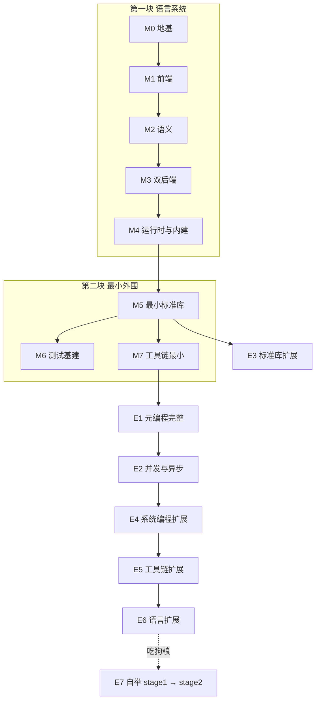

# H 语言实现计划（三块：语言系统 / 最小外围 / 扩展与自举）

> **结构**：本计划分三块——**第一块 = 语言系统**（语言本身的完整实现：前端、语义、双后端、运行时与语言内建机制，是「语言包」）；**第一块交付后语言即可解析、编译、运行自身核心**；**第二块 = 最小外围**（最小标准库、测试基建、基础工具链——与语言系统共同构成**第一部分「最小功能集」，不要求自举**）；**第三块 = 扩展功能 + 第一部分未完全完成的功能 + 自举**（**实现要求可自举**：用 H 语言编译 H 语言，stage0 Rust → stage1 H 重写 → stage2 闭环）。本计划为 `02-milestones.md`（1.0 里程碑）的功能拆分细表。

## 一、总体结构图

**三块模型**：
- **第一块 语言系统（M0–M4）**：Rust 实现语言本身——前端、语义、双后端、运行时与语言内建机制（`@` 内建、`box`/`copy`、序列化内建、标量接口族、`ExitType`、迭代内建）。**语言系统交付 = 语言可解析/检查/编译/解释全部语法**（含**脚本模式**——`hc run` 解释执行，双模式核心承诺，属 M3.2）
- **第二块 最小外围（M5–M7）**：最小标准库（四大支柱基础）、测试基建、基础工具链——与语言系统构成**第一部分最小功能集（不自举）**
- **第三块 扩展与自举（E1–E7）**：补齐**脚本生成（E1，`script` 块元编程）**、**多线程/并发/异步（E2）**、标准库/系统编程/工具链/语言扩展 + **自举**（stage1 渐进 → stage2 闭环）——**脚本生成与多线程仅在第三块实现，第一部分最小功能集明确不实现（最小例子不必实现）**

---

## 二、第一块：语言系统（M0–M4）

> **目标**：语言本身的完整实现（「语言包」）——从源码到可执行的全部编译/解释机制 + 语言内建能力。**验收**：全部示例可解析、语义检查通过、双模式运行一致；`@` 内建、序列化内建、标量接口族、迭代内建可用。

### M0 地基

| 模块 | 功能 | 详细说明 |
|---|---|---|
| M0.1 工作区 | cargo 三 crate | `hc`（编译器前端）/ `hc-rt`（运行时）/ `hc-tools`（工具链）；CI（lint + 快照测试 + 文档构建） |
| M0.2 基线 | 示例基线 | 全部示例（85 编号示例 + 86/87/88 + math.hc）→ token/AST/执行结果快照（每阶段回归基准） |

### M1 前端（lexer / parser / AST / 诊断 / 模块）

| 模块 | 功能 | 详细说明 |
|---|---|---|
| M1.1 Lexer | token 流 | 关键字全集（`class`/`enum`/`tree`/`interface`/`where`/`o`/`move`/`script`/`comptime` 等）+ `box`/`copy` + `@` 前缀内建；运算符全集（`%%`、`..`、`=>`、`\|x\|`、`\|\|`）；字符（`'x'` = u8）/字符串（`"..."` 转义 + `"""..."""` 多行原始）/数字字面量（惰性宽度 + 0x/0b/0o）；注释 `//` `///` `/* */`；全 token 带位置 |
| M1.2 Parser | AST 构建 | 表达式优先级表（Q4）；语句/声明；类型标注（`o`/`*`/`*mut`/`&[T]`/`&mut [T]`/`?T`/`E!T`/元组 `(T1,T2)`）；`where` 子句；switch（穷举 + 捕获 + else 兜底）；if/while 双向捕获（Q9/Q10）；`defer`/`errdefer`；`test fn`（Q-R11）；`class`/`enum`（合一式）/`interface`（冒号标注）/`tree`/`namespace` |
| M1.3 诊断 | 错误报告 | 多错误收集、精确位置、颜色分级；接入 `@compileError` |
| M1.4 | 模块（**M1.4 完整**，2026-08-16） | `namespace`（跨文件/一文件多组）+ `using`（含 `as 别名`）+ 兄弟文件符号登记；**语义检查器跨文件符号**（`check_semantics_extern`：外部类型/函数/错误集/namespace 并入——限定名 `Orders.Line` 字段校验、`Math.square` 调用可查）；**using 导入**（语义 + 运行时：函数 + **类型** + 全局，扁平名直接可用，自身定义优先）；目录 = 包（test/run/check 加载同目录兄弟）；pub 解析保留（同包即达，跨包见 build.zon） |

### M2 语义（类型 + 所有权 + 错误集 + 函数）

| 模块 | 功能 | 详细说明 |
|---|---|---|
| M2.1 名称解析 | 符号表 | 作用域链、namespace 限定、泛型 T/where 绑定、**重载登记**（签名 = 函数名 + 参数类型列表 + 返回类型）、接口三用途 |
| M2.2 类型检查 | 类型系统 | 标量 + 接口族（`ICompare`/`INumber`/`IInt`/`IUint`/`IFloat`，内建实现）；**class 存储形态自动判定**（连续内存 vs 堆上）；枚举（任意负载、`@intFromEnum`/`@enumFromInt`）；元组（多值返回/解构）；`Table`；切片；可选；错误联合；指针（不可空）；**迭代契约 `IIterable` 三态**；**泛型 where 约束编译时验证**（接口限制运行时拆除） |
| M2.3 推断 | 推断优先 | 变量绑定/字面量惰性宽度/泛型 T/指针形态/返回类型推断（Q-S9）；参数与字段类型必须显式；重载歧义报错要求显式 |
| M2.4 所有权 | 来源判定 + 销毁 | 分配来源（非 Arena 默认当前作用域 / Arena 归 Arena / global 归根作用域）；作用域退出递归销毁（LIFO）；`move`（唯一约束 = 拥有所有权；原绑定仍可访问）；**引用类型赋值 = 编译错误**（显式 `copy(&x)`/指针）；`copy` 深/浅复制；global 初始化（程序启动、声明序 + 跨文件依赖拓扑排序） |
| M2.5 引用 | `*T`/`*mut T` | 不可空（Q16）；指针自由（多 `*mut`/`*T` 合法、可复制、指针问题用户负责）；Debug 悬垂标记（编译时选项，可选诊断）；**definite assignment（C7）：`alloc.init(T)` 无参构造 + 逐字段赋值的初始化状态跟踪——任何退出路径前全字段已赋值，否则编译错误** |
| M2.6 错误集 | 显式 / 推断 / anyerror | 显式错误集检查（Q13）；`!T` 推断收集（Q-S8）；`error.Name` 全局唯一；**错误码表**（编译器维护「名 ↔ 码」） |
| M2.7 函数 | 重载 / 可选参数 / 闭包 | 重载解析（参数精确匹配、返回类型上下文选择、歧义报错）；可选参数（尾部、编译期常量默认值）；闭包（只读/mut/move 捕获、按值返回规则） |

### M3 双后端（共享 IR + VM + LLVM）

| 模块 | 功能 | 详细说明 |
|---|---|---|
| M3.1 共享 IR | 唯一语义源 | 语义分析输出 IR；双后端共用，禁止各后端私语义（ADR-0004）；双模式一致性承诺的根基 |
| M3.2 VM | 字节码解释器 | 脚本模式（`hc run`）；作用域所有权 + defer + 错误处理 + 序列化内建 |
| M3.3 LLVM | 原生代码生成 | inkwell 绑定（锁定版本）；Release 裸路径零开销；静态链接默认（编译模式） |
| M3.4 一致性 | 双模式对照 | 同一程序两模式结果一致；一致性套件为 CI 硬门槛；`hc test --mode=compile` 交叉验证（Q-T5） |

### M4 运行时与语言内建

| 模块 | 功能 | 详细说明 |
|---|---|---|
| M4.1 内存运行时 | 作用域销毁 + 分配器机制 | 作用域退出递归销毁（LIFO）；分配器机制（显式传递 + 默认回退，每线程独立）；Arena 统一回收 |
| M4.2 错误/终止 | 错误码 + panic | 错误码运行时表示（码 + 成功标记，零额外负载）；`@panic("消息", 位置)` abort（Q-S2）；`ExitType` 退出映射 |
| M4.3 @ 内建基础集 | 编译期/转换 | `@sizeOf`/`@alignOf`/`@offsetOf`/`@typeOf`/`@intCast`/`@ptrCast`/`@alignCast`/`@compileError`/`@addWithOverflow` 等/`@intFromEnum`/`@enumFromInt`（Q-S1/Q-S6） |
| M4.4 数据内建 | box / copy / 序列化内建 | `box(value, alloc)`（装箱）/ `copy(&x)`（深/浅复制）编译器内建；**序列化 = 内建契约**——连续类型 `to_bytes`/`from_bytes`（直映射 + `packed`/`align` 尊重）、堆类型 `to_json`/`from_json`、集合 → 字节（u64 LE 前缀） |
| M4.5 标量接口族内建 | ICompare / INumber 族 | 内建标量自动实现 `ICompare`/`IInt`/`IUint`/`IFloat`（`i8–i128`/`isize`、`u8–u128`/`usize`、`f16–f128`）；运算符绑定（`a + b` ≡ `a.add(b)`）；String 内建实现 `ICompare` |
| M4.6 迭代内建 | IIterable 三态 | 数组/切片/Vec/Map/Table/String 内建实现 `IIterable(*T)`/`IIterable(*mut T)`/`IIterable(o T)`；`iter()` 显式迭代器对象 |
| M4.7 悬垂标记 | Debug 可选诊断 | 目标销毁时标记指向它的指针，访问提示带位置（编译时选项，非安全保证） |

---

## 三、第二块：最小外围（M5–M7）

> **目标**：与语言系统共同构成**第一部分最小功能集**（不自举）——最小标准库（四大支柱基础）、测试基建、基础工具链。**验收**：`hc build`/`hc run`/`hc test` 完整可用，示例套件双模式一致、测试全绿。

### M5 最小标准库（四大支柱基础）

| 模块 | 功能 | 详细说明 |
|---|---|---|
| M5.1 mem | Allocator / Arena 实例 | 默认分配器、Arena 类型与实例（分配器机制在语言系统 M4.1，此处为库类型） |
| M5.2 collections | 容器 | `Vec`/`String`（`u8[]` 别名）/`Map`/`Deque`（最小方法集：append/len/get/put/remove/迭代）；`Table` 构造 |
| M5.3 serialize 库 | 序列化封装 | 内建序列化（M4.4）之上的库封装与辅助（解析辅助、格式辅助） |
| M5.4 io 最小 | print / fs / net / 环境 | `io.print`（格式串）；`io.fs`（open/read/write/append/rename/remove/list_dir/**seek/pos/read_at/write_at**）；`io.net` 基础（TCP connect/listen/accept/帧读写）；**程序环境**（`io.args()`/`io.env(n)`/`io.stdin`/`stdout`/`stderr`/`io.exit(ExitType, code)`） |
| M5.5 时间/调试 | 基础工具 | `io.time.now()`/`sleep`；`debug` 断言（测试辅助） |

### M6 测试基建

| 模块 | 功能 | 详细说明 |
|---|---|---|
| M6.1 测试 | test fn 体系 | `test fn` 收集/运行；断言五件套（`expect`/`expect_eq`/`expect_neq`/`expect_error`/`expect_eq_slices`）；`[PASS]/[FAIL]/[SKIP]` + 汇总；失败非零退出码；`test_io`/`alloc` 注入；默认串行；双模式交叉 |

### M7 工具链最小

| 模块 | 功能 | 详细说明 |
|---|---|---|
| M7.1 命令 | `hc build` / `hc run` / `hc test` | build：编译包内全部文件（静态链接）；run：脚本模式单文件/包运行；test：M6 测试体系 |
| M7.2 包基础 | build.zon | 依赖清单 = H 数据字面量（`const build = Build{...}`）；单包 + 本地依赖；**指纹校验/注册中心 → 第三块** |

---

## 四、第一部分（最小功能集）明确不实现的功能

> **脚本生成与多线程在第三块（第二部分）实现——最小功能集明确不实现（最小例子不必实现）**。注意区分：**脚本模式（`hc run` 解释执行）= 双模式核心承诺，属第一块语言系统 M3.2（必须实现）**；**脚本生成（`script` 块元编程）= 第三块 E1（最小集不实现）**；**多线程/并发/异步 = 第三块 E2（最小集不实现）**。

- **脚本生成（`script` 块）**：types 元数据/就地替换/实时预览——第三块 E1 实现；第一部分仅泛型 where 基础（comptime 泛型）
- **comptime 完整**：`comptime { ... }` 块、类型即值/惰性实例化——第三块 E1
- **多线程/并发/异步全部**：四模式类型、线程、Future/async/await、通道、`Io.evented`、`@atomic` 原语——第三块 E2
- **标准库扩展**：UDP/HTTP、ipc、storage/archive、text、time 完整、rng、FFI（`extern fn`/`@cImport`/`hc cc`）
- **系统编程**：K1–K6/K7–K11 缺口、H core（freestanding）
- **工具链扩展**：LSP、format、lint、注册中心、供应链指纹校验
- **语言扩展**：惰性迭代、switch 守卫、Send/Sync 静态标记、并发测试
- **自举**（见第三块 E7）

---

## 五、第三块：扩展功能 + 未完成项 + 自举（E1–E7）

> **目标**：补齐第一部分未完成项 + 扩展功能；**本块实现要求可自举**——用 H 语言重写编译器并自举闭环。**验收**：`用 H 编译 H` 达成（stage2）。

### E1 元编程完整

| 模块 | 功能 | 详细说明 |
|---|---|---|
| E1.1 script 块 | 脚本生成 | `script { ... }`：隐式 `types` 元数据对象（`types.fields/type/all`，Q23）；产物 = 代码字符串就地替换；编辑器实时预览与校验；**错误机制统一**（脚本块失败 = 编译错误，带块内 + 所属块位置）；供应链指纹校验 |
| E1.2 comptime 完整 | 编译期求值 | `comptime { ... }` 块、泛型实例化完整（`fn List(T: type) type`）、类型即值、`anytype`、comptime_int/float 完整语义 |
| E1.3 序列化定制 | 脚本定制通道 | 脚本生成序列化/校验/存储样板（数据定义 → 样板，Q37/Q38） |

### E2 并发与异步

| 模块 | 功能 | 详细说明 |
|---|---|---|
| E2.1 四模式类型 | 共享内存容器 | `OneToOne/OneToMany/ManyToOne/ManyToMany`：write/read/try_read/close/send/recv；**缓冲语义**（共享内存无容量、通道有界 `init(alloc, cap)`）；单写者无锁路径 |
| E2.2 线程 | spawn/join/cancel | `spawn(f, args...) o Thread(T)`；join/cancel（协作式）/is_done/detach；线程所有权（作用域 → 根作用域提升）；捕获规则（值复制/move/global + Q18 绑定例外 + Q19 冻结窗口） |
| E2.3 异步 | Future/async/await | `async fn` → `Future(R)`；`await` ≡ `join()`（任何函数可用）；协作式取消；`Io.threaded()`/`Io.evented()`（单线程事件循环） |
| E2.4 原子 | @atomic | `@atomicLoad/Store/Rmw` + C11 五内存序；四模式内部实现基础 |

### E3 标准库扩展

| 模块 | 功能 | 详细说明 |
|---|---|---|
| E3.1 net 完整 | UDP / HTTP | `io.net.udp`（bind/send_to/recv_from）；HTTP 客户端/服务端 |
| E3.2 ipc | 进程间通信 | 管道、共享内存 |
| E3.3 storage/archive | 保存数据扩展 | 键值存储接口、数据库连接抽象、归档与压缩 |
| E3.4 text/time/rng | 工具扩展 | 文本处理（正则等）、时间与时区完整、伪随机数 |
| E3.5 ffi | C 互操作 | `extern fn` + `@cImport`（Q-S4：内建 C 解析器）；C 指针外置 + `box` 进入；错误码手动映射；`hc cc` |

### E4 系统编程扩展

| 模块 | 功能 | 详细说明 |
|---|---|---|
| E4.1 K1–K6 | 底层机制裁决与实现 | K1 无标签 union、K2 volatile、K3 内联汇编 asm、K4 `@ptrFromInt`/`@intFromPtr`、K5 `export fn` + 链接脚本、K6 freestanding（裸机模式）——1.0 范围裁决后实现 |
| E4.2 K7–K11 | 系统级类型 | 裸函数指针、位域、指针算术、`@byteSwap`、`Atomic(T)` |
| E4.3 H core | 无 OS 依赖子集 | K6 纳入时从 std 抽取（无 OS 依赖核心）；否则留 1.x |

### E5 工具链扩展

| 模块 | 功能 | 详细说明 |
|---|---|---|
| E5.1 LSP / format / lint | 质量工具 | 编辑器诊断（脚本实时预览通道复用）；格式化；lint |
| E5.2 包管理完整 | 注册中心 | 官方注册中心（自托管 MVP → 治理规则）；供应链审计；版本锁定 |

### E6 语言扩展（1.x 项 + 开放问题裁决）

| 模块 | 功能 | 详细说明 |
|---|---|---|
| E6.1 语言扩展 | 1.x 项 | 惰性迭代、switch 守卫、Send/Sync 静态标记、并发测试、`05` 开放问题 #1/#3/#4/#5/#6 裁决 |
| E6.2 吃狗粮反馈 | 语言成熟 | 编译器编写过程中暴露的语言缺口反馈回设计 |

### E7 自举（stage1 → stage2）

| 模块 | 功能 | 详细说明 |
|---|---|---|
| E7.1 H 重写 stage1 | 用 H 写编译器 | 渐进：H lexer → parser/AST → 语义（类型/所有权/错误集）→ 后端（IR/VM/LLVM）；与 Rust 版双实现对照（token/AST/执行结果对比，差异即 bug） |
| E7.2 自举闭环 stage2 | 用 H 编译 H | H 编译器（H 程序）用 stage1 编译自身；产物再编译产物（二次自举验证）；**可复现构建**（同源码同结果） |
| E7.3 规范一致性 | 规范 ↔ 实现 | 语言规范一致性测试（语法/语义/内存/并发）；Rust/H 双实现交叉验证 |

---

## 六、关键节点时间表（乐观）

| 节点 | 内容 | 里程碑产出 |
|---|---|---|
| T1（M0–M2 后） | 前端 + 语义完整 | `hc` 语法工具 + 语义检查（全部示例可解析） |
| T2（M3 后） | 双后端可运行 | 同一示例脚本/编译双模式运行一致 |
| T3（M4 后） | **语言系统完整** | **语言包可用：语法/语义/双后端/运行时/内建全部就绪** |
| T4（M5–M7 后） | **第一部分完成** | **最小功能集可用：`hc build`/`hc run`/`hc test` 完整**（不自举） |
| T5（E1–E2 后） | 元编程 + 并发完整 | 脚本生成/泛型完整；四模式/线程/异步可用 |
| T6（E3–E5 后） | 标准库 + 工具链完整 | 四大支柱完整；LSP/注册中心可用 |
| T7（E7 后） | **自举闭环** | 用 H 编译 H ✅（stage2） |
| T8（E6 + 冻结） | 1.0 冻结 | 1.0 checklist 全绿 |

## 七、与 02-milestones 的关系

- `02-milestones.md`：1.0 里程碑（M0–M10）与特性↔阶段映射——本计划的功能拆分是其实现细表
- **差异点（三块）**：第一块语言系统（M0–M4）≈ 02 的 M1–M6（前端/语义/双后端/运行时）；第二块最小外围（M5–M7）≈ 02 的 M7–M8 主体（标准库最小/工具链最小），**不含**脚本生成完整/并发完整/系统编程；第三块（E1–E7）承接脚本生成（M3 完整）、并发（M5）、系统编程缺口、自举（M9）与 1.x 项
- 自举（E7）为**第三块的实现要求**（可自举），不阻塞第一、二块（最小功能集）交付
- 两文档互相引用；里程碑验收以本计划功能模块为准绳

---

## 八、实现状态（tag1 垂直切片，2026-08-15）

> 项目根目录 `tag1/` 为第一阶段（最小功能集）首轮实现。**垂直切片范围**：全部 7 个里程碑的核心功能打通，非全量交付；余量按模块登记于下表（下一轮迭代补齐）。

### 已实现（✅）

| 里程碑 | 模块 | 说明 |
|---|---|---|
| M0.1 | cargo 三 crate 工作区 | `hc`（前端）/ `hc-rt`（运行时）/ `hc-tools`（CLI）；零外部依赖，可编译 |
| M1.1 | Lexer | 关键字全集、运算符（含 `%%`/`..`/`=>`/`|x|`/`||`/`^=`）、`@` 前缀、字符串/`"""` 原始串/字符、数字（进制+后缀+`_`）、注释、位置 |
| M1.2 | Parser + AST | 变量/常量/global/函数/`test fn`/class/enum/interface/namespace/using/特性标注 `[continuous] [pad] [align]`；if/while/for/switch/defer/errdefer；闭包；元组解构；错误集别名；`alloc.init` 双形态；尾随逗号；关键字变体/方法名 |
| M1.3 | 诊断 | 多错误收集、行/列位置、源码行指示 |
| M2.1 | 名称解析 | 作用域链、函数登记（重载池）、类型登记、接口三用途占位 |
| M2.2 | 类型检查（**M2.2 完整**，2026-08-16） | 标量/String/数组/切片/元组/可选/错误联合/指针；**表达式级类型检查**（全部 Expr 变体静态推断）；**期望类型传播**（var 初始化/赋值/return/调用实参/二元运算/条件/迭代）；**字段与索引校验**（NamedLit 字段存在/必填/类型/未知、元组越界、Table 双整数索引）；**存储形态验证**（[continuous] 字段全值类型否则编译错误）；**运算符接口族检查**（算术→INumber、位→整数、序/等→ICompare）；**泛型 where 约束调用点验证**（标量→INumber 族、class→冒号标注接口） |
| M2.3 | 推断（子集） | 变量绑定推断、字面量惰性宽度、返回类型（单路径） |
| M2.4 | 所有权（**编译时检查完整**，2026-08-16） | 分配来源判定（非 Arena 作用域注册 / Arena / global）、作用域 LIFO 销毁、`move` 标记（AST `Expr::Move` 保留）；**新增**：**分配来源跟踪**（VarInfo.source：None 值类型 / NonArena / Arena / Global / Unknown，按 init 形态+类型判定）；**move 合法性**（Arena/global/值类型无所有权 → 编译错误，对齐 C④）；**引用逃逸（Q18）**（`return &局部/参数` → 编译错误，带所有权参数须 `return move`；global 引用放行）；引用类型赋值禁止 / copy 深浅复制保留 |
| M2.7 | 函数 | 重载（**具体优先于泛型**）、可选参数（尾部默认）、闭包（只读/mut 捕获、env 快照） |
| M2.6 | 错误码表（**M2.6 完整**，2026-08-16） | 编译器维护「错误名 ↔ 码」全局唯一映射（`hc/src/errorcodes.rs`）；**编码 = 高位 16 位包 ID + 低位 16 位包内序**（L5 定案，跨包不冲突）；每错误记录**首次出现位置**（span）——错误报告以原始错误位置为前提（不输出调用链）；三类来源全收集（错误集声明成员 / `error.X` 字面量 / switch 模式）；`hc errors <file>` 输出表；**错误传播模型**：函数声明错误联合（`E!T`/`!T`）→ `error.X` 沿**值通道**传播直到 `try`/`catch` 处理（try 不转抛错通道，catch 全链可拦截）；**未标记错误类型**（返回值非错误联合）`return error.X` → 编译错误；未处理错误到根作用域 → 记录错误名位置输出（`error.Name at 行:列`）→ panic 式中止（非零退出，无恢复） |
| M3.1 | 共享 IR（**已落地**，2026-08-16） | `hc/src/ir.rs`：线性指令 + 标签形态（`IrInst`/`IrConst`/`IrBinOp`），AST→IR 降级 `lower` + 参考解释器 `run_ir`（双后端共同语义源，ADR-0004）；覆盖：标量运算/比较/短路 `and or`/if（语句 + 表达式 + else-if + optional 捕获 `|v|`）/while（含续步 `(i += 1)`）/return/try/catch（默认值 + 绑定块值，块值只求值一次）/orelse/error 字面量/全局与命名空间调用（多级限定名 `io.net.connect` 展平）/断言内建；**作用域槽分配**（块退出恢复外层绑定）、**复合赋值** `x += 1`、**checked 算术**（溢出 `Overflow`、除/模零 `DivisionByZero`，与 tree-walking arith 一致）；错误值走值通道（try 返回 / catch 拦截）；不做（记录扩展）：defer/errdefer、for/switch、break/continue、闭包、集合/class 方法、指针操作 |
| M3.2 | 脚本模式 | tree-walking 解释器（`hc run`）；defer/错误传播/`try`/`catch`/`orelse`（含控制流兜底）；**M3.4 修复**：块值（末位表达式语句）+ 多级 namespace 限定调用（io.net.double）；**过渡形态**：`hc run --ir` 显式模式标志接入 IR 参考解释器（M3.2 字节码 VM 的前身，见梯队 11） |
| M3.4 | 双模式一致性（**已落地**，2026-08-16） | `hc-rt/tests/consistency.rs`：同一程序分别经 **tree-walking 解释器**（脚本模式）与 **IR 参考解释器**（`run_ir`，M3.1 唯一语义源）运行全部 `test fn`，PASS/FAIL 必须完全一致（ADR-0004 承诺根基，CI 硬门槛）；结果归一化：IR `Ok(非错误)` = PASS、`Ok(错误值)` = FAIL（M2.6 未处理错误到根 panic 式失败）、`Err` = FAIL；覆盖 M3.1 切片全功能（标量/短路/if 三形态/while 续步/递归/try/catch/orelse/error 字面量/断言/限定名调用含多级 namespace/作用域遮蔽/复合赋值/除零溢出）；**一致性驱动的运行时修复**：① tree-walker 块值缺漏——`exec_stmt` 丢弃末位表达式值导致 catch 块值/块表达式恒 void（改为末位表达式产生 `Flow::Value`，语句位 if/块丢弃防早退）；② tree-walker 多级 namespace 限定调用未查函数表（eval_call Field 分支先查扁平限定名，与单级 Dot 形态一致） |
| M4.3 | @ 内建（基础集完整，2026-08-16） | `@` 前缀 token 解析；**@sizeOf**（标量/连续 class 布局与 to_bytes 一致/枚举/引用类型=指针宽）、**@alignOf**（自然对齐）、**@offsetOf**（连续字段偏移含填充）、**@typeOf**（类型名）、**@intCast**（Debug 范围检查溢出抛错）、**@ptrCast**/@alignCast（透传）、**@compileError**（编译期错误拦截）、**@addWithOverflow**/@sub/@mul（(T,bool) 元组）；@intFromEnum/@enumFromInt/@panic 已有 |
| M4.2 | 错误码运行时表示（**M4.2 完整**，2026-08-16） | **`Value::Err { name, code }`**（码 = M2.6 表「包 ID + 包内码」，全局唯一；运行时未登记错误名动态分配——anyerror 任意码）；比较/匹配/断言走码或名；**根作用域报告带码**（`error.NotFound (0x00000000) at 1:6`）；`@panic`/`ExitType`/`io.exit` 已有；成功路径零额外负载（值枚举无 Err 开销） |
| M4.4 | 序列化内建 | `to_bytes`/`from_bytes`（连续类型直映射、集合 u64 前缀）、`to_json`/`from_json`（class/Map） |
| M4.5 | 标量接口族 | `a.add(b)` 等方法形式（add/sub/mul/div/neg/mod/abs/eq/lt）、`String.compare` |
| M4.6 | 迭代内建 | 数组/切片/Str/Map 可迭代（含 `|kv|` 键值对）；`iter()/filter()/map()` 立即求值链 |
| M5.1 | mem | `Arena.init`、`arena.alloc(n)`、`alloc.alloc(n)` |
| M5.2 | collections | `Vec`（append/len/iter/from_bytes）、`Map`（put/get/contains/remove/len/遍历）、String 方法集（concat/split/join/find/substring/replace/as_slice/to_bytes） |
| M5.4 | io 完整（**M5.4 完整**，2026-08-16） | `io.print` 格式串；`io.fs`（open/create/read_file/read_all/write_all/append/remove/rename/list_dir/read_int/write_int + **seek/pos/read_at/write_at**）；**`io.net` TCP**（connect/listen(0 端口)/local_port/accept 阻塞/write/read(n)/read_all/shutdown/close + **u32 LE 帧读写** read_u32_le/write_u32_le）；程序环境（args/env/stdin 读一行/stdout/stderr/io.exit(ExitType, code)） |
| M5.5 | 工具 | `io.time.now()`（毫秒）/`sleep`（ms）；`sort`（含比较器闭包）、`binary_search`、`sqrt`、`math` 命名空间、`parse_int`/`parse_float`、parser 辅助内建 |
| M6.1 | 测试 | `test fn` 收集运行；断言五件套；`[PASS]/[FAIL]/[SKIP]` + 汇总；失败非零退出码；`test_io`/`alloc` 注入 |
| M7.1 | CLI | `hc run` / `hc run --ir`（IR 参考解释器过渡模式，M3.2 字节码 VM 过渡形态）/ `hc test` / `hc check` / `hc build`（字节码镜像 + 启动器过渡产物） |
| **M2.2+** | **语义检查器**（2026-08-15 梯队 1） | 静态 pass（`hc/src/semantic.rs`，load 前运行）：**标量宽度检查**（`var g: u8 = 256` 编译期报错）、**引用赋值禁止**（`var w: Vec(i32) = v` 报错——要求 `copy(&v)` 或指针）、连续类型赋值放行、**错误集成员检查**（return `error.X` 必须属于函数错误集）、**definite assignment（C7）**（`alloc.init(T)` 无参构造后字段未全赋值即 return → 编译期报错）、类型元数据收集 |
| **M4.3+** | **@ 内建补充**（2026-08-15） | `@intFromEnum`/`@enumFromInt`（变体序 ↔ 枚举，M4.3 子集） |
| **M8** | **Table 类型**（2026-08-15） | `Table(T).init(alloc, rows, cols, init)` 构造 + `t[i, j]` 多参索引（仅 Table 合法） |
| **L1** | **copy 浅复制**（2026-08-15） | `copy(&x, .shallow)`（CopyMode 内建枚举，`.name` 推断枚举字面量）；默认深复制不变 |
| **L1** | **`.name` 推断枚举字面量**（2026-08-15） | `copy(&x, .shallow)` ≡ `copy(&x, CopyMode.shallow)` |
| M2.5 | **definite assignment（C7）**（2026-08-15 收尾） | `alloc.init(T)` 无参构造跟踪待初始化字段集；字段赋值逐一消除；return 时缺失字段 → CompileError（修复 Dot/Field 解析形态差异） |
| M2.5/M4.7 | Debug 悬垂标记（**已落地**，2026-08-16） | `&x` 登记目标 cell；**作用域退出 = 目标销毁 → 目标 cell 内容标记 `Value::Dangling`**（有指针持有的 cell 不释放、地址唯一——无地址碰撞误判）；解引用访问（`d.*`/`p.x`/`s[i]`/写路径）已标记 → `DanglingPointer` 抛错**带位置**；`debug_dangling` 开关（Debug 默认开，Release 裸读用户负责）；取指针不抛错（Q18） |

**测试基线（2026-08-16）**：`hc` 前端 **33** 单测（13 原有 + 9 M2.6 + 7 M2.4 + 4 M1.4） + **IR 22**（M3.1） + `hc-rt` errors **17** + semantics **47**（13 原有 + 24 M2.2 + 3 M2.5 + 7 M4.3） + **io 6**（net echo/帧/fs seek/时间/环境/连接拒绝） + **一致性 14**（M3.4） + **hc-tools 8**（`run_ir_source` 单测，M3.2 过渡）全绿；`hc test examples/` 全目录 **122/134 通过**（12 失败全属第三块 E1/E2 特性，见下）。

> **2026-08-15 梯队 1 更新**：语义检查器（宽度/引用赋值/错误集成员/definite assignment）、`@intFromEnum`/`@enumFromInt`、Table 类型、copy 浅复制、`.name` 推断枚举均已落地。

> **2026-08-16 梯队 2 更新（M2.2 完整）**：表达式级类型检查 + 期望类型传播 + 字段/索引校验 + 存储形态验证 + 运算符接口族检查 + 泛型 where 约束调用点验证全部落地（`hc/src/semantic.rs` 重写为完整静态类型检查器；AST/parser 保存 where 子句）。示例回归 **122/134 与基线一致**；已知取舍：`ex46_recursion` 栈溢出（tree-walking 递归深度）与 12 个 E1/E2 失败保留。

> **2026-08-16 梯队 3 更新（M2.6 错误码表）**：「错误名 ↔ 码」表 + 包 ID/包内码编码 + 首次出现位置 + `hc errors` 命令 + 根作用域错误报告（`error.Name at 行:列` + panic 式中止）全部落地（`hc/src/errorcodes.rs`；`interp.rs` 根作用域处理）。前端单测 13→22、errors 7→9；示例回归不变。

> **2026-08-16 梯队 3b 更新（错误传播模型收尾）**：按定案——**标记错误联合**（`E!T`/`!T`）的函数：错误沿**值通道**传播直到 `try`/`catch`（修复 `try` 转抛错通道绕过 catch 的缺陷——`try` 改 signal 值返回，`catch` 全链可拦截）；**未标记错误类型**：非错误联合函数 `return error.X` → 编译错误（`semantic.rs`）；未处理错误到根（main/测试根）→ 记录位置 + panic 式中止/记 FAIL。errors 7→14；示例回归 122/134 不变。

> **2026-08-16 梯队 4 更新（M2.4/M2.5）**：**M2.4 所有权编译时检查**——分配来源跟踪（VarInfo.source）+ move 合法性（Arena/global/值类型禁止，对齐 C④）+ 引用逃逸 Q18（`return &局部/参数` 禁止，带所有权参数须 `return move`）落地（`semantic.rs`；AST 保留 `Expr::Move`）；**M2.5/M4.7 Debug 悬垂标记**——`&x` 登记、作用域退出把目标 cell 标记 `Value::Dangling`、解引用访问抛 `DanglingPointer` 带位置、`debug_dangling` 开关（Release 裸读）落地（`interp.rs`/`value.rs`；cell 内容标记方案无地址碰撞）。前端单测 22→29、semantics 37→40；示例回归 122/134 不变。

> **2026-08-16 梯队 5 更新（M4.2 错误码运行时表示）**：`Value::Err` 从字符串迁移为 **`{ name, code }`**（码 = M2.6 编译期表；运行时未登记错误名动态分配）；错误比较/匹配/断言走码；根作用域报告带码（`error.NotFound (0x00000000) at 行:列`）；`@panic`/`ExitType`/`io.exit` 保持。errors 14→17；示例回归 122/134 不变。错误系统闭环：编译期表（M2.6）↔ 运行时值（M4.2）一致。

> **2026-08-16 梯队 6 更新（M4.3 @ 内建基础集）**：@sizeOf/@alignOf/@offsetOf（连续类型布局与 to_bytes 一致——可验证直映射）、@typeOf、@intCast（Debug 溢出检查）、@ptrCast/@alignCast（透传）、@compileError（编译期拦截）、@addWithOverflow 三件套落地（`interp.rs` call_builtin + `semantic.rs` call_at_builtin）。semantics 40→47；示例回归 122/134 不变。

> **2026-08-16 梯队 7 更新（M5.4 io 完整）**：**io.net TCP 基础**（connect/listen/local_port/accept/write/read/read_all/shutdown/close + u32 LE 帧读写）、**fs seek/pos/read_at/write_at**（create 改读写权限）、**io.stdin** 落地（`interp.rs` call_net_method/call_conn_method/call_listener_method）；`io.time.now/sleep` 核实已实现（M5.5 一并落地）。新增 `hc-rt/tests/io.rs` 6 测试；示例回归 122/134 不变。

> **2026-08-16 梯队 8 更新（M1.4 跨文件模块）**：**语义检查器跨文件符号**（`check_semantics_extern`——兄弟文件类型/函数/错误集/namespace 并入，限定名 `Orders.Line` 字段校验与 `Math.square` 调用可准确检查，`semantic.rs` collect_decl_prefixed 双登记）；**using 导入补齐**（语义 + 运行时 collect_using：函数 + 类型 + 全局，`as 别名`，扁平名直接可用）。前端单测 29→33；示例回归 122/134 不变（41/43/44 多文件示例通过）；运行时验证 using 导入类型直接引用 + 限定调用。

> **2026-08-16 梯队 9 更新（M3.1 共享 IR）**：`hc/src/ir.rs` 线性 IR + 参考解释器落地（`lower`/`run_ir` 导出）——标量/短路/if（else-if、表达式、optional 捕获）/while（续步）/try/catch/orelse/error 字面量/限定名调用（多级 `io.net`）/断言内建；作用域槽分配（块退出恢复外层绑定）+ 复合赋值 + 块值单次求值，语义对齐 tree-walking 解释器；错误值走值通道（try 返回/catch 拦截）。新增 `hc/tests/ir.rs` 22 测试；示例回归 122/134 不变。IR 为唯一语义源（ADR-0004），M3.2 VM 与 M3.3 LLVM 共用；break/continue/for/switch/defer 不在 IR 范围（记录扩展）。

> **2026-08-16 梯队 10 更新（M3.4 双模式一致性）**：一致性套件 `hc-rt/tests/consistency.rs`（14 测试）落地——同一程序 tree-walking 与 IR 参考解释器全 test fn PASS/FAIL 必须一致；**套件捕获两处 tree-walker 缺陷并修复**：① **块值缺漏**——`exec_stmt` 丢弃末位表达式值，catch 绑定块/块表达式恒 void（IR 按规范返回末位表达式值）→ `exec_block_inner` 末位表达式语句产生 `Flow::Value`，语句位 if/块丢弃防中间语句早退（示例回归 122/134 不变）；② **多级 namespace 限定调用**——`io.net.double` 解析为 Field 形态，eval_call 从未查函数表（单级 `Math.square` 为 Dot 形态可用）→ Field 分支先展平查表（`qualified_flat_name`），与 IR 展平降级一致。另对齐 `binop` checked 语义（溢出 Overflow / 除模零 DivisionByZero，与 tree-walking arith 一致）。新增一致性 14 测试；示例回归 122/134 不变。

> **2026-08-16 梯队 11 更新（IR 接入 `hc run --ir`，M3.2 字节码 VM 过渡形态）**：显式模式标志 `hc run --ir <file>` 用 **IR 参考解释器**（`run_ir`，M3.1 唯一语义源）替代 tree-walking 执行（`hc-tools/src/main.rs`，核心抽成 `run_ir_source`——不依赖文件系统/退出码，可单测）。**执行流程**：解析 → 语义检查（准确优先：能精确判定才报错，与 tree-walking load 内建检查对齐）→ `lower` → 查 `func_index` 有 `main`（无 → NoMain）→ `run_ir(module, "main", [])`；**切片范围 = M3.1 切片**（标量/短路/if/while/return/try/catch/orelse/error 字面量/限定名调用/断言内建），**不支持** io/集合/class/闭包/指针/for/switch/defer/break/continue/全局变量；**main 入口**：零参 `main` 可完整运行，`main(io: Io)` 的 io 参数为 Void 占位（用 io.* 走 NoFunction + 提示，正常）；**根错误映射**：`Ok(Err)` → `error.X 到达入口（未处理）` 非零退出（panic 式失败，无恢复）、`Ok(_)` → 成功（退出码 0，main 返回非零 Int 不影响）、`Err(IrError)` → `error.{name}: {message}` 非零退出（NoFunction/TypeError 追加「程序使用了 IR 切片外特性（io/集合/指针等）——请用默认 tree-walking 模式 hc run <file>」提示）；**默认 `hc run`（无 `--ir`）tree-walking 路径零改动**。新增 `hc-tools` 单测 8 个（切片内成功含 if/while/try/catch、main(io) Void 占位、未处理错误、除零、NoMain、切片外 io.print 提示、解析诊断）；示例回归 122/134 不变。

### 未实现（登记后续迭代）

| 模块 | 功能 | 归口 |
|---|---|---|
| M1.4 | 跨文件模块（包内文件共享命名空间）——**已落地**（2026-08-16：外部符号语义检查 + using 类型/全局导入；见已实现表） | M1.4/M7.2 |
| M2.2 完整 | 类型检查完整（表达式级类型检查、期望类型传播、表/元组/连续类型字段校验）——**2026-08-16 已落地**（见已实现表） | M2 |
| M2.4/M2.5 | 所有权编译时检查、Debug 悬垂标记——**2026-08-16 已落地**（见已实现表） | M2.4/M2.5/M4.7 |
| M2.6 | 错误码表（包 ID + 包内码）——**2026-08-16 已落地**（见已实现表） | M2.6 |
| M2 完整 | 期望类型传播（返回类型参与重载选择）——**2026-08-16 已落地**（静态 match_overloads ret_matches + 运行时 expected_ret，双端一致） | M2 |
| M3.3 | LLVM 原生后端（`hc build` 占位——LLVM 依赖外部系统库） | M3 |
| M4.2 | 错误码运行时表示、`@panic`、`ExitType` 退出映射——**2026-08-16 已落地**（见已实现表） | M4.2 |
| M4.3 | @ 内建全集——**基础集已落地**（2026-08-16，余下见已实现表） | M4.3 |
| M5.4 | 真实 io（fs/net/env/args/exit）——**2026-08-16 已落地**（见已实现表） | M5.4 |
| M5.5 | 时间——**已落地**（2026-08-16 核实：io.time.now/sleep） | M5.5 |
| E1 | 脚本生成（`script` 块）、comptime 完整（类型即值） | E1（第三块） |
| E2 | 并发/异步/线程全部 | E2（第三块） |

**示例验收说明（2026-08-16）**：剩余 12 个失败示例分属——E1 元编程（35-comptime、34-generics、63-template）、E2 并发（37–39/76–80）、接口错误契约（24-interface-errors 引用未实现 json/csv 库）——均为第三块（第二部分）特性或未实现库，属已知失败。

**已知取舍**：tree-walking 解释器替代字节码 VM；`hc build` 占位（LLVM 依赖外部系统库，留 M3.3）；u64 移位按 64 位截断（xorshift 语义）；闭包捕获整个作用域链（自由变量精确分析留后续）；`ex46_recursion` 递归示例栈溢出（tree-walking 递归深度，测试套件已知红项）。
